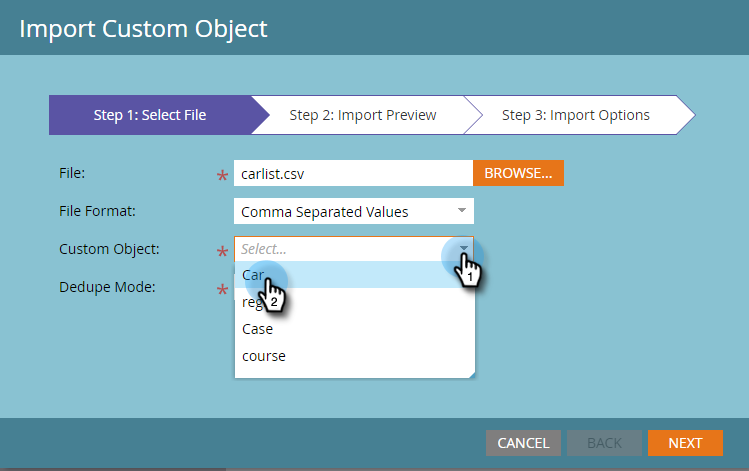

# Importar datos de objetos personalizados {#import-custom-object-data}

Es fácil importar datos de objeto personalizados en la base de datos. Si usa objetos personalizados con empresas, vea [Usar objetos personalizados con empresas](/help/marketo/product-docs/administration/marketo-custom-objects/understanding-marketo-custom-objects.md#using-custom-objects-with-companies) para obtener más información.

1. En Mi Marketo, vaya a **[!UICONTROL Base de datos]**.

   

1. Haga clic en **[!UICONTROL Nuevo]** y seleccione **[!UICONTROL Importar datos de objeto personalizados]**.

   

1. Haga clic en **[!UICONTROL Examinar]** para buscar el archivo de datos. Seleccione el formato de archivo (Valores separados por comas en este ejemplo).

   

1. Seleccione su [!UICONTROL objeto personalizado].

   

1. Seleccione [!UICONTROL Modo de desduplicación] de la lista desplegable. Haga clic en **[!UICONTROL Siguiente]**.

   

   >[!NOTE]
   >
   >Utilice los campos de desduplicación como identificadores únicos al crear o actualizar registros de objetos personalizados. Este ejemplo usa el campo Desduplicación del objeto personalizado **car**: vin (número de identificación del vehículo). Si solo está actualizando registros de objetos personalizados, puede seleccionar [!UICONTROL Marketo Guid] como [!UICONTROL Modo de desduplicación].

1. Asigne cada columna a un campo de Marketo, seleccionándolo en la lista desplegable.

   

   >[!NOTE]
   >
   >Asegúrese de que los valores del archivo coincidan con el tipo de campo con el que los hace coincidir (por ejemplo, texto, entero, etc.); de lo contrario, el archivo se rechazará.

1. Haga clic en **[!UICONTROL Siguiente]**.

   

1. Haga clic en **[!UICONTROL Importar]**.

   

   >[!NOTE]
   >
   >El límite de tamaño para los objetos personalizados es de 100 MB.

   >[!TIP]
   >
   >Escriba su dirección de correo electrónico en el campo **[!UICONTROL Enviar alerta a]** y Marketo le enviará un correo electrónico cuando finalice la importación.

1. En la esquina superior derecha de la pantalla, verá una notificación mientras se ejecuta la importación y los resultados finales cuando se complete.

   

   ¡Yay!

>[!MORELIKETHIS]
>
>[Explicación de los objetos personalizados de Marketo](/help/marketo/product-docs/administration/marketo-custom-objects/understanding-marketo-custom-objects.md)
