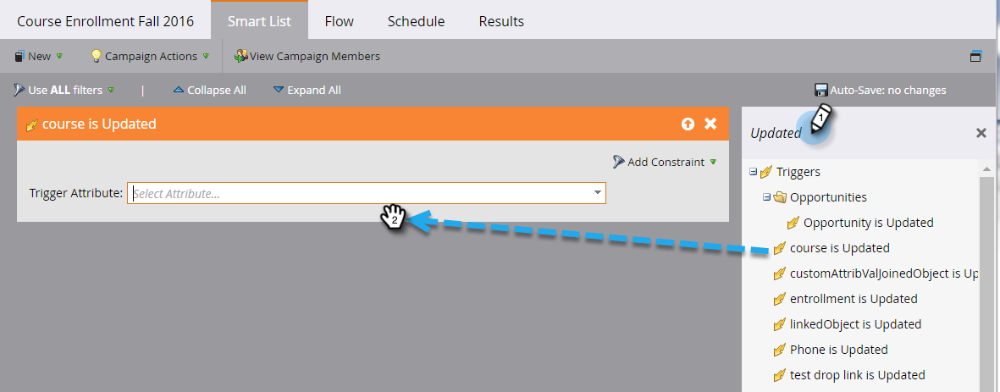

# Déclencheur de cambios de objetos personalizados {#trigger-off-custom-object-changes}

>[!NOTE]
>
>Esta función solo está disponible:
>
>* Para clientes de [!DNL Orion] infraestructura
>* Para su uso únicamente con objetos personalizados de Marketo, no con objetos personalizados sincronizados a través del nativo [!DNL Salesforce] o [!DNL Microsoft Dynamics] integración
>* Como déclencheur, no como filtro
>
>Póngase en contacto con [Asistencia de Marketo](https://nation.marketo.com/t5/Support/ct-p/Support) para tener activados los Déclencheur de cambio de objeto personalizado.

En la lista inteligente de una campaña inteligente, puede almacenar en déclencheur una acción de flujo cuando se agrega un objeto personalizado a una persona o compañía. También puede crear una lista inteligente que utilice un *cambiar* en un objeto personalizado como déclencheur. Por ejemplo, utilícelo para enviar un correo electrónico cuando se actualice un nombre de curso.

>[!NOTE]
>
>No se crea una entrada de registro de actividad cuando se cambia un registro de objeto personalizado.

1. En Marketo Engage, vaya a **[!UICONTROL Actividades de marketing]**.

   

1. Cree o abra una campaña inteligente existente y seleccione la lista inteligente.

   

1. Busque el déclencheur que necesite y arrástrelo al lienzo.

   

1. Seleccione el [!UICONTROL atributo de déclencheur].

   

1. Si lo desea, defina una restricción.

   

1. Y ahí estás. El cambio se guarda automáticamente.

   

   >[!NOTE]
   >
   >* [Crear una lista inteligente](/help/marketo/product-docs/core-marketo-concepts/smart-lists-and-static-lists/creating-a-smart-list/create-a-smart-list.md)
   >* [Explicación de los objetos personalizados de Marketo](/help/marketo/product-docs/administration/marketo-custom-objects/understanding-marketo-custom-objects.md)

