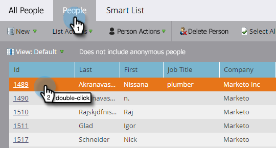

# Explicación de los objetos personalizados de Marketo {#understanding-marketo-custom-objects}

Utilice objetos personalizados para realizar un seguimiento de métricas específicas de su empresa.

>[!AVAILABILITY]
>
>No todos los clientes han adquirido esta funcionalidad. Póngase en contacto con su representante de ventas para obtener más información.

Utilice objetos personalizados como filtros y déclencheur en sus campañas inteligentes. Por ejemplo:

* **Filtrar**: envíe correos electrónicos solo a los propietarios de una marca de vehículo específica
* **Déclencheur**: envíe un correo electrónico cuando se añada un objeto personalizado a una persona o empresa.

Puede configurar objetos personalizados en una relación de uno a varios o de varios a varios. Por ejemplo:

* **Uno a varios**: Una persona posee varios coches
* **Varios a varios**: varios alumnos se inscriben en varios cursos desde un catálogo de cursos

Una estructura &quot;uno a varios&quot; utiliza un único campo de vínculo para conectar el objeto personalizado a una persona o compañía.

Los objetos personalizados &quot;varios a varios&quot; utilizan dos campos de vínculo, que forman parte de un objeto intermedio. Un campo Vínculo está conectado a la persona o empresa y otro al objeto personalizado, como el catálogo de cursos. Este objeto intermedio puede contener campos personalizados adicionales, como una calificación de curso o una fecha de asistencia, que definen aún más la naturaleza de la conexión.

>[!TIP]
>
>Importe objetos personalizados con valores separados por comas (CSV) en la interfaz de usuario para probar y validar una muestra de datos. A continuación, cargue todos los archivos con una API.

>[!CAUTION]
>
>No puede restaurar objetos personalizados, por lo que asegúrese de que ya no los necesita antes de eliminarlos.

## Acceso a objetos personalizados de Marketo {#accessing-marketo-custom-objects}

1. Vaya a la **[!UICONTROL Administrador]** área.

   

1. Clic **[!UICONTROL Objetos personalizados de Marketo]**.

   

1. La visualización Objetos personalizados de Marketo muestra todos los objetos personalizados a la derecha, pero solo los aprobados en la cuadrícula principal.

   

   >[!NOTE]
   >
   >La cuadrícula muestra el nombre del objeto, el número de registros, el número de campos y la fecha de la actualización más reciente.

   >[!TIP]
   >
   >Marketo actualiza estos campos automáticamente, pero puede actualizar la visualización haciendo clic en el icono de la columna Registros.

1. Haga clic en el nombre del objeto a la derecha para abrir la página de detalles.

   

## Ver objetos personalizados asociados a una persona {#view-custom-objects-associated-to-a-person}

Después de crear la estructura de objetos personalizada, al cargar los datos de objetos personalizados específicos, los objetos personalizados se asocian automáticamente a las personas de la base de datos mediante el campo de vínculo del objeto personalizado. Puede ver información desde el [!UICONTROL Objetos personalizados] en la página de detalles de la persona.

1. Ir a **[!UICONTROL Base de datos]**.

   

1. Abra la base de datos y haga clic en **[!UICONTROL People]** pestaña. Haga doble clic en el registro de una persona asociada a un objeto personalizado.

   

1. En la página de detalles de la persona, haga clic en **[!UICONTROL Objetos personalizados]** pestaña. Seleccione el objeto de la lista desplegable.

   

1. Ahora puede ver una lista de todos los objetos personalizados de ese tipo asociados a esa persona.

   

## Uso de objetos personalizados con compañías {#using-custom-objects-with-companies}

Un objeto personalizado vinculado a la empresa funciona mejor si sincroniza empresas desde CRM o si crea empresas explícitamente mediante la API. También recomendamos que utilice el ID de la compañía como campo de vínculo.

Si tiene varias personas en Marketo que son registros de los registros solo de CRM o de Marketo, un objeto personalizado vinculado a una compañía no se asociará con más de un registro individual. Esto se debe a que una empresa con varias personas debajo solo es compatible cuando las empresas están sincronizadas desde CRM o si utiliza una API para crear empresas explícitamente.

Los objetos personalizados solo pueden vincularse directamente a un único registro. Esto significa que, cuando el tipo de objeto personalizado está vinculado por campo de empresa, debe asegurarse de que los registros de persona estén asociados a una empresa mediante la conversión de contactos en su CRM o mediante el campo externalCompanyId, si administra empresas mediante las API de REST de Marketo. Para los registros de persona que no están vinculados explícitamente a los registros de compañía, los objetos personalizados vinculados mediante compañía se vincularán aleatoriamente a un único registro, incluso si el valor del campo de compañía se comparte entre muchas personas.

Consulte [Importar datos de objeto personalizados](/help/marketo/product-docs/administration/marketo-custom-objects/import-custom-object-data.md) para obtener más información.

>[!MORELIKETHIS]
>
>* [Crear objetos personalizados de Marketo](/help/marketo/product-docs/administration/marketo-custom-objects/create-marketo-custom-objects.md)
>* [Aprobar un objeto personalizado](/help/marketo/product-docs/administration/marketo-custom-objects/approve-a-custom-object.md)
>* [Editar y eliminar un objeto personalizado de Marketo](/help/marketo/product-docs/administration/marketo-custom-objects/edit-and-delete-a-marketo-custom-object.md)
>* [Agregar campos de objeto personalizados de Marketo](/help/marketo/product-docs/administration/marketo-custom-objects/add-marketo-custom-object-fields.md)
>* [Editar y eliminar campos de objetos personalizados de Marketo](/help/marketo/product-docs/administration/marketo-custom-objects/edit-and-delete-marketo-custom-object-fields.md)
>* [Importar datos de objeto personalizados](/help/marketo/product-docs/administration/marketo-custom-objects/import-custom-object-data.md)
