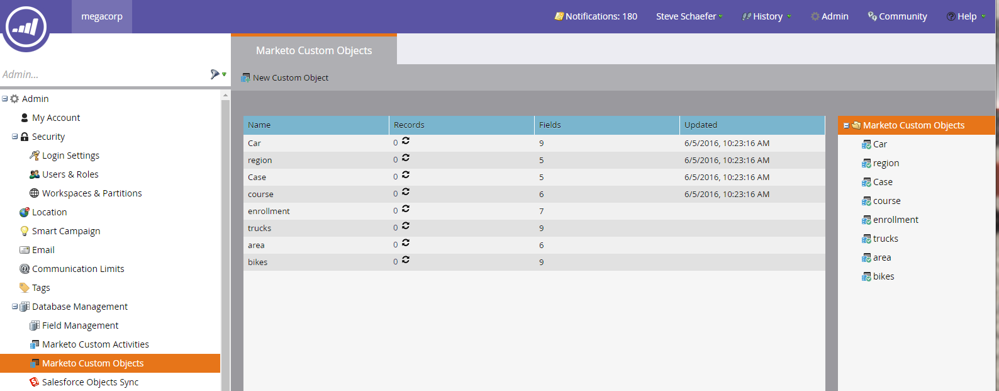

# Explicación de los objetos personalizados de Marketo {#understanding-marketo-custom-objects}

Utilice objetos personalizados para realizar un seguimiento de las métricas específicas de su negocio.

>[!AVAILABILITY]
>
>No todos los clientes han adquirido esta funcionalidad. Póngase en contacto con su representante de ventas para obtener más información.

Utilice objetos personalizados como filtros y déclencheur en sus campañas inteligentes. Por ejemplo:

* **Filtro**: Enviar correos electrónicos solo a los propietarios de una marca de vehículo específica
* **Déclencheur**: Enviar un correo electrónico cuando se añada un objeto personalizado a una persona o empresa.

Puede configurar objetos personalizados en una relación de uno a varios o de varios a varios. Por ejemplo:

* **De uno a varios**: Una persona posee varios coches
* **Varios a varios**: Varios estudiantes están inscritos en varios cursos desde un catálogo de cursos

Una estructura de uno a varios utiliza un único campo de vínculo para conectar el objeto personalizado a una persona o empresa.

Muchos a muchos objetos personalizados utilizan dos campos de vínculo, que forman parte de un objeto intermedio. Un campo Vínculo está conectado a la persona o empresa y otro está conectado al objeto personalizado, como el catálogo del curso. Este objeto intermedio puede contener campos personalizados adicionales, como una categoría de curso o una fecha de asistencia, que definen aún más la naturaleza de la conexión.

>[!TIP]
>
>Importe objetos personalizados mediante valores separados por comas (CSV) en la interfaz de usuario para probar y validar una muestra de datos. A continuación, cargue todos los archivos con una API.

>[!CAUTION]
>
>No puede restaurar objetos personalizados, por lo que debe asegurarse de que ya no los necesita antes de eliminarlos.

## Acceso a objetos personalizados de Marketo {#accessing-marketo-custom-objects}

1. Para crear o editar objetos personalizados de Marketo, haga clic en **Admin** y luego en el enlace **Marketo Custom Objects**.

   

1. La visualización de objetos personalizados de Marketo muestra todos los objetos personalizados de la derecha, pero solo los aprobados de la cuadrícula principal.

   

1. La cuadrícula muestra el nombre del objeto, el número de registros, el número de campos y la fecha de la última actualización.

   >[!TIP]
   >
   >Marketo actualiza estos campos automáticamente, pero puede actualizar la visualización haciendo clic en el icono de la columna Registros .

1. Haga clic en el nombre de objeto a la derecha para abrir la página de detalles.

   

## Ver objetos personalizados asociados a una persona {#view-custom-objects-associated-to-a-person}

Después de crear la estructura de objetos personalizada, al cargar los datos de objetos personalizados específicos, los objetos personalizados se asocian automáticamente a los usuarios de la base de datos mediante el campo de vínculo del objeto personalizado. Puede ver información desde la ficha Objetos personalizados en la página de detalles de la persona.

1. Vaya a **Database**.

   

1. Abra la base de datos y haga clic en la pestaña **People**. Haga doble clic en el registro de una persona asociada a un objeto personalizado.

   

1. En la página de detalles de la persona, haga clic en la ficha **Objetos personalizados**. Seleccione el objeto en la lista desplegable.

   

1. Ahora puede ver una lista de todos los objetos personalizados de ese tipo asociados a esa persona.

   

## Uso de objetos personalizados con compañías {#using-custom-objects-with-companies}

Un objeto personalizado vinculado a la empresa funciona mejor si sincroniza empresas desde CRM o si crea empresas explícitamente mediante la API. También recomendamos que utilice el ID de empresa como campo de vínculo.

Si hay varias personas en Marketo que son registros en CRM o solo en Marketo, un objeto personalizado vinculado a una empresa no se asociará con más de un registro individual. Esto se debe a que una empresa con varias personas debajo de ella solo es compatible cuando las empresas se sincronizan desde CRM o si utiliza una API para crear empresas explícitamente.

Los objetos personalizados solo pueden vincularse directamente a un único registro. Esto significa que, cuando el tipo de objeto personalizado está vinculado por el campo de la empresa, debe asegurarse de que los registros de persona estén asociados a una empresa mediante la conversión de contacto en su CRM o mediante el campo externalCompanyId, si administra empresas mediante las API de REST de Marketo. En el caso de los registros de personas que no están vinculados explícitamente a registros de empresa, los objetos personalizados vinculados mediante empresa se vincularán aleatoriamente a un registro único, incluso si el valor del campo de empresa se comparte entre muchas personas.

Consulte [Importar datos de objetos personalizados](/help/marketo/product-docs/administration/marketo-custom-objects/import-custom-object-data.md) para obtener más información.

>[!MORELIKETHIS]
>
>* [Crear objetos personalizados de Marketo](/help/marketo/product-docs/administration/marketo-custom-objects/create-marketo-custom-objects.md)
>* [Aprobar un objeto personalizado](/help/marketo/product-docs/administration/marketo-custom-objects/approve-a-custom-object.md)
>* [Editar y eliminar un objeto personalizado de Marketo](/help/marketo/product-docs/administration/marketo-custom-objects/edit-and-delete-a-marketo-custom-object.md)
>* [Agregar campos de objeto personalizados de Marketo](/help/marketo/product-docs/administration/marketo-custom-objects/add-marketo-custom-object-fields.md)
>* [Editar y eliminar campos de objetos personalizados de Marketo](/help/marketo/product-docs/administration/marketo-custom-objects/edit-and-delete-marketo-custom-object-fields.md)
>* [Importar datos de objeto personalizados](/help/marketo/product-docs/administration/marketo-custom-objects/import-custom-object-data.md)

