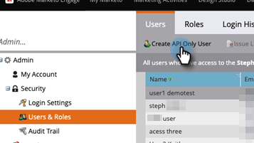

# Añadir usuario solo de API para suscripciones habilitadas para Adobe IMS {#add-api-only-user-for-adobe-ims-enabled-subscriptions}

Mientras que los usuarios y administradores de marketing de Marketo Engage se administran en Adobe Admin Console, los usuarios solo de API de Marketo Engage deben crearse y administrarse en Marketo Engage.

Los pasos siguientes describen cómo agregar un usuario solo de API en Marketo Engage. Antes de hacerlo, debe tener [se ha establecido una función de solo API](/help/marketo/product-docs/administration/users-and-roles/create-an-api-only-user-role.md).

1. En Marketo, haga clic en **Administrador** y seleccione **Usuarios y funciones**.

   

1. Haga clic en **Crear usuario solo de API**.

   

1. Introduzca un correo electrónico, nombre y apellidos para el usuario solo de la API.  Seleccione la función solo de API que desea asignar al usuario. Haga clic en **Crear usuario solo de API** cuando haya terminado.

   

>[!NOTE]
>
>Cuando la acción se realice correctamente, se cerrará el modal Crear solo usuario de API y se actualizará la lista de usuarios, y el nuevo usuario será visible.
