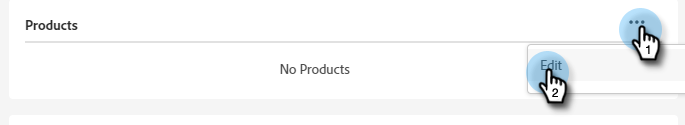

# Agregar o quitar un administrador de productos {#add-or-remove-a-product-admin}

>[!NOTE]
>
>**Los administradores del sistema** solo se crean en el nivel de organización de Adobe. Si cree que necesita más de uno, comuníquese con [Soporte técnico de Marketo](https://nation.marketo.com/t5/support/ct-p/Support).

## Añadir un administrador de productos {#add-a-product-admin}

>[!IMPORTANT]
>
>Se debe agregar un administrador a un perfil de producto para obtener acceso a Marketo Engage.

1. Inicie sesión en [Adobe Admin Console](https://adminconsole.adobe.com/){target="_blank"}.

   

1. Haga clic en **Marketo Engage**.

   

1. Seleccione la suscripción deseada (si tiene más de una).

   

1. Haga clic en la ficha **[!UICONTROL Administradores]**.

   

1. Haga clic en el botón **[!UICONTROL Agregar administrador]**.

   

1. Introduzca la dirección de correo electrónico o el nombre de usuario del administrador que desea añadir. El nombre y los apellidos son opcionales. Haga clic en **[!UICONTROL Guardar]**.

   

1. Haga clic en el nombre del administrador que acaba de añadir.

   

1. En Productos, haga clic en el menú de tres puntos y seleccione **[!UICONTROL Editar]**.

   

1. Haga clic en el signo **+**. Haga clic en las comillas angulares junto a la suscripción de Marketo Engage deseada (si hay más de una) y seleccione el perfil de producto deseado.

   

1. Haga clic en **[!UICONTROL Guardar]**.

   

El usuario recibirá dos correos electrónicos. El primer correo electrónico les notifica que se les han concedido derechos de administrador de productos al Marketo Engage. El segundo correo electrónico les invita a iniciar sesión en el Marketo Engage.

>[!NOTE]
>
>Cuando se añade el usuario administrador de productos al Marketo Engage mediante Adobe Admin Console, se otorga al usuario la función Administrador de productos de Adobe dentro de la suscripción.

## Eliminar un administrador {#remove-a-user}

1. Inicie sesión en [Adobe Admin Console](https://adminconsole.adobe.com/){target="_blank"}.

   

1. Haga clic en **Marketo Engage**.

   

1. Seleccione la suscripción deseada (si tiene más de una).

   

1. Haga clic en la ficha **[!UICONTROL Administradores]**.

   

1. Seleccione el administrador que desee eliminar y haga clic en el botón **[!UICONTROL Eliminar administrador]**.

   

1. Haga clic en **[!UICONTROL Quitar administrador]** para confirmar.

   

El usuario recibe un correo electrónico que le notifica que ya no tiene acceso de administrador de productos a Marketo Engage.
