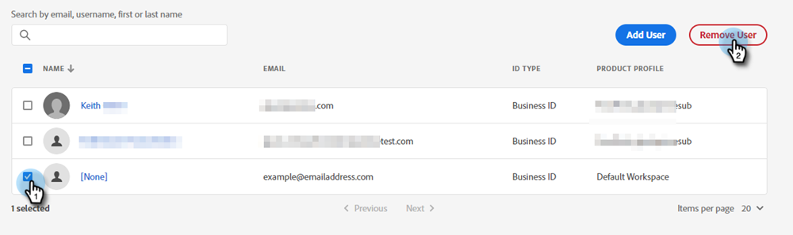

# Agregar o eliminar un usuario {#add-or-remove-a-user}

## Agregar un usuario {#add-a-user}

1. Inicie sesión en la [Adobe Admin Console](https://adminconsole.adobe.com/).

   

1. Haga clic en **Marketo Engage**.

   

1. Seleccione la suscripción deseada (si tiene más de una).

   

1. Haga clic en el **Usuarios** pestaña .

   

1. Haga clic en el **Agregar usuario** botón.

   

1. Introduzca el nombre, el grupo de usuarios o la dirección de correo electrónico del usuario que desea añadir. El nombre y los apellidos son opcionales.

   

1. Haga clic en el **+** y seleccione el perfil de producto deseado.

   

1. Haga clic en **Guardar**.

   

El usuario recibirá un correo electrónico para iniciar sesión en Marketo.

>[!NOTE]
>
>Cuando el usuario se añade al Marketo Engage a través de Adobe Admin Console, se le concede la función &quot;Usuario estándar&quot; dentro del espacio de trabajo predeterminado de la suscripción. Si es necesario ajustar la función del usuario dentro del espacio de trabajo, se realiza en Marketo Engage, [tal como se describe aquí](/help/marketo/product-docs/administration/users-and-roles/managing-user-roles-and-permissions.md).

## Eliminar un usuario {#remove-a-user}

1. Inicie sesión en la [Adobe Admin Console](https://adminconsole.adobe.com/).

   

1. Haga clic en **Marketo Engage**.

   

1. Seleccione la suscripción deseada (si tiene más de una).

   

1. Haga clic en el **Usuarios** pestaña .

   

1. Seleccione el usuario que desea eliminar y haga clic en el botón **Eliminar** botón.

   

1. Haga clic en **Eliminar usuario** para confirmar.

   

El usuario recibirá un correo electrónico en el que se le notificará que ya no tiene acceso al administrador de productos a Marketo Engage.

>[!MORELIKETHIS]
>
>* [Usuarios de Adobe Admin Console](https://helpx.adobe.com/enterprise/using/users.html)
>* [Administrar usuarios individualmente](https://helpx.adobe.com/enterprise/using/manage-users-individually.html)

