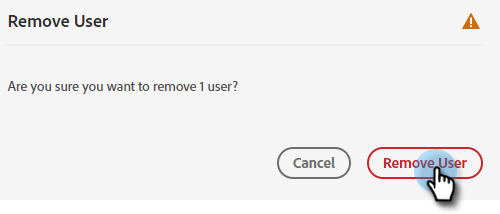

# Agregar o quitar un usuario {#add-or-remove-a-user}

## Añadir un usuario {#add-a-user}

1. Inicie sesión en [Adobe Admin Console](https://adminconsole.adobe.com/){target="_blank"}.

   

1. Clic **Marketo Engage**.

   

1. Seleccione la suscripción deseada (si tiene más de una).

   

1. Haga clic en **[!UICONTROL Usuarios]** pestaña.

   

1. Haga clic en **[!UICONTROL Añadir usuario]** botón.

   

1. Escriba el nombre, el grupo de usuarios o la dirección de correo electrónico del usuario que desea agregar. El nombre y los apellidos son opcionales.

   

1. Haga clic en **+** y seleccione el perfil de producto que desee.

   

   >[!IMPORTANT]
   >
   >Un usuario _debe_ se añaden a un perfil de producto para obtener acceso a Marketo Engage.

1. Clic **[!UICONTROL Guardar]**.

   

El usuario recibirá un correo electrónico para iniciar sesión en el Marketo Engage.

>[!NOTE]
>
>Cuando se añade un usuario al Marketo Engage mediante Adobe Admin Console, se le otorga la función &quot;Usuario estándar&quot; dentro del espacio de trabajo predeterminado de la suscripción. Si es necesario ajustar la función del usuario dentro del espacio de trabajo, esto se hace en Marketo Engage, [como se describe aquí](/help/marketo/product-docs/administration/users-and-roles/managing-user-roles-and-permissions.md){target="_blank"}.

## Eliminar un usuario {#remove-a-user}

1. Inicie sesión en [Adobe Admin Console](https://adminconsole.adobe.com/){target="_blank"}.

   

1. Clic **Marketo Engage**.

   

1. Seleccione la suscripción deseada (si tiene más de una).

   

1. Haga clic en **[!UICONTROL Usuarios]** pestaña.

   

1. Seleccione el usuario que desee eliminar y haga clic en **[!UICONTROL Eliminar]** botón.

   

1. Clic **[!UICONTROL Quitar usuario]** para confirmar.

   

El usuario recibe un correo electrónico que le notifica que ya no tiene acceso a Marketo Engage.

>[!MORELIKETHIS]
>
>* [Usuarios de Adobe Admin Console](https://helpx.adobe.com/enterprise/using/users.html){target="_blank"}
>* [Administrar usuarios individualmente](https://helpx.adobe.com/enterprise/using/manage-users-individually.html){target="_blank"}
