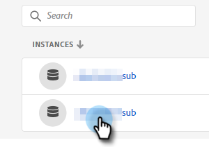

# Ajustes de administración {#admin-setup}

Después de que se le añada como administrador del sistema de Adobe al Marketo Engage en una organización de Adobe, deberá seguir algunos pasos para completar la configuración inicial.

## Configuración inicial {#initial-setup}

1. Cuando se le haya añadido como administrador del sistema designado para Marketo Engage (en una organización nueva o ya creada), recibirá un correo electrónico de bienvenida. En ese mensaje de correo electrónico, haga clic en **[!UICONTROL Introducción]**.

   

1. Si ya ha accedido a una aplicación con un Adobe ID, se le redirigirá directamente a Adobe Admin Console. Si no es así, [configure su Adobe ID](https://helpx.adobe.com/es/manage-account/using/create-update-adobe-id.html){target="_blank"}.

   

## Crear un perfil de producto {#create-a-product-profile}

Una vez que el administrador del sistema accede al Admin Console, es hora de crear un perfil de producto. Así es como los usuarios/administradores obtienen acceso a Marketo Engage.

1. En la página **[!UICONTROL Información general]**, en **[!UICONTROL Productos y servicios]**, haga clic en **Marketo Engage**.

   

1. Elija la suscripción deseada. Si solo tiene uno, vaya al paso siguiente.

   

   >[!NOTE]
   >
   >Si tiene varias suscripciones, se deben seguir estos pasos para cada una.

1. Haga clic en el botón **[!UICONTROL Nuevo perfil]**.

   

1. Asigne un nombre al perfil de producto (el nombre para mostrar y la descripción son opcionales) y haga clic en **[!UICONTROL Siguiente]**.

   

1. No es necesario seleccionar ningún servicio. Haga clic en **[!UICONTROL Guardar]**.

>[!NOTE]
>
>Si configura varios perfiles de producto, los usuarios tendrán el mismo acceso a Marketo, independientemente del perfil al que se añadan.

>[!MORELIKETHIS]
>
>[Agregar o quitar un administrador de productos](/help/marketo/product-docs/administration/marketo-with-adobe-identity/add-or-remove-a-product-admin.md){target="_blank"}
