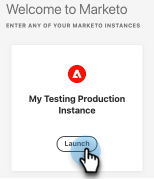

# Preguntas frecuentes sobre Adobe Identity Management {#adobe-identity-management-faq}

**¿Qué es Adobe Identity?**

El sistema de administración de identidades de Adobe consta de tres componentes.

* [!DNL Adobe Identity Service]: gestiona la autenticación y validación del usuario final, incluido el inicio de sesión único (SSO) de federación y tiempo de ejecución.

* Adobe Admin Console: ofrece una ubicación central para la gestión de los derechos de Adobe en toda su organización. Gestiona la administración de usuarios, el servicio en la nube, el derecho de licencia de escritorio y la configuración de federación, y proporciona funciones de seguridad para evitar la pérdida de datos.

* API de administración de usuarios (UMAPI) de Adobe: permite a las organizaciones administrar usuarios y derechos empresariales en Adobe Admin Console, en el nivel de API.

**¿Cuándo se integrarán las suscripciones de Marketo Engage existentes con IMS?**

Las suscripciones de Marketo Engage existentes se están migrando actualmente a Adobe IMS en cada evento de ventas, incluidos eventos de renovación, nueva contratación o complementos. Las migraciones externas a los eventos de ventas son compatibles a partir de octubre de 2024.

**Después de la migración, ¿las URL de Marketo Engage seguirán siendo las mismas?**

No. Después de la migración, las URL aparecerán con el siguiente formato: `https://experience.adobe.com/#/@tenantID/so:XXX-XXX-XXX/marketo-engage/classic/` (las XXX representan el ID de Munchkin y la parte @tenantID corresponde a su organización de Adobe).

**¿Tenemos que hacer algo para preparar el cambio de dirección URL?**

Sí. Después de la migración, Marketo Engage dejará de estar disponible en experience.adobe.com para estarlo en Adobe Experience Cloud. Deberá trabajar con su equipo de TI para incluir en la lista de permitidos todos los dominios de Adobe enumerados [en la parte superior de este artículo](/help/marketo/getting-started/initial-setup/configure-protocols-for-marketo.md){target="_blank"} a fin de evitar interrupciones en el acceso a Marketo Engage.

Los vínculos y marcadores anteriores a los recursos de Marketo Engage en el dominio engage-xx.marketo.com _seguirán funcionando_. Sin embargo, primero debe iniciar sesión en la instancia de Marketo Engage para la URL a la que vaya a navegar. Por ejemplo, para navegar a un marcador de una campaña inteligente en una instancia con el ID de Munchkin 123-ABC-456, primero debe iniciar sesión en la instancia de Marketo Engage con el ID de Munchkin 123-ABC-456.

Si bien aún no se ha planificado, el trabajo de desarrollo futuro puede interrumpir esta función de redireccionamiento. Para evitar interrupciones inesperadas, se recomienda actualizar los marcadores lo antes posible.

**¿Funciona esto con SSO?**

Sí. La integración con Adobe IMS es compatible con usuarios de ID universal y SSO. SSO ahora está dirigido por Adobe IMS y se configura en el nivel de organización en Adobe Admin Console. Sin embargo, existen diferencias entre la compatibilidad iniciada con IdP de Marketo Engage y la compatibilidad iniciada con SP de Adobe ([obtenga más información aquí](https://helpx.adobe.com/es/enterprise/using/set-up-identity.html){target="_blank"}). Si necesita ayuda con respecto a las diferencias de SSO tras la migración a Admin Console, póngase en contacto con el [Servicio de atención al cliente de Adobe](https://helpx.adobe.com/es/contact.html){target="_blank"}.

**¿Cuál es la diferencia entre un administrador de productos de Adobe y un administrador de Marketo Engage?**

* El administrador de productos de Adobe es una función nueva de la plataforma Marketo.
* La función Administrador de productos de Adobe se concede a los usuarios añadidos como administradores de productos en Adobe Admin Console
* El administrador de productos de Adobe es una función de solo lectura y no se puede editar ni eliminar de Marketo Engage.
* El administrador de productos de Adobe tiene los mismos derechos y privilegios que un administrador de Marketo estándar.
* La función del administrador de Marketo Engage sigue siendo la de administrador y se concede a un usuario de Marketo Engage.
* Solo los usuarios con función de administrador predeterminado de Marketo se asignan como administrador de productos de Marketo en Admin Console.

**¿Hay algún cambio en la asistencia técnica al cliente de API de administración de usuarios?**

Sí. Los que se hayan incorporado a IMS de Adobe no pueden utilizar todas las API de administración de usuarios de Marketo existentes. Para las acciones de invitación, actualización y eliminación de usuarios, se deben usar las [API de IMS](https://www.adobe.io/apis/experienceplatform/umapi-new.html){target="_blank"} de Adobe. Para la administración de funciones, se siguen usando las API de administración de usuarios de Marketo. Aparte de esto, no hay ningún otro cambio en la asistencia técnica al cliente de la API de REST de Marketo.

**¿Con quién nos ponemos en contacto para obtener asistencia si estamos integrados con IMS?**

* Migración previa al usuario: gestionar casos de soporte en la [Comunidad de Marketing Nation](https://nation.marketo.com/t5/support/ct-p/Support) o por correo electrónico `customercare@marketo.com`.

* Migración posterior al usuario: gestionar casos de soporte en la [Comunidad de Marketing Nation](https://nation.marketo.com/t5/support/ct-p/Support) o por correo electrónico `customercare@marketo.com`.

* Finalización de la migración posterior a la asistencia: los administradores de soporte de productos pueden gestionar casos a través del portal de soporte de Experience League.

Si dispone de Ultimate Success, tiene acceso al servicio de migración prémium de Admin Console. Póngase en contacto con el equipo de cuentas de Adobe (su administrador de cuentas) para obtener ayuda.

**Si uso una identidad de Adobe para acceder a otras aplicaciones de Adobe, ¿puedo usarla también para acceder a Marketo?**

Aunque tenga otros productos de Adobe, no podrá acceder a Marketo con su identidad de Adobe hasta que la suscripción se haya migrado a IMS.

**¿Se administran las funciones de usuario de Marketo (dentro de los espacios de trabajo) en Adobe Admin Console?**

No. La administración de funciones de usuario (dentro de los espacios de trabajo) ha finalizado en Marketo Engage.

**Soy administrador de Marketo con una suscripción integrada a IMS y no tengo acceso a Admin Console. ¿Cómo puedo obtener acceso?**

Cualquier administrador de productos o sistemas de Adobe con acceso a Admin Console de su organización podrá proporcionarle acceso. Si no está seguro de quién en su organización tiene privilegios de administrador en la consola, póngase en contacto con el [Servicio de atención al cliente de Adobe](https://helpx.adobe.com/es/contact.html){target="_blank"}.

**¿Cómo añade un administrador usuarios a Marketo [!DNL Sales Connect]?**

Aunque haya una tarjeta de producto en Admin Console para [!DNL Sales Connect], Admin Console no debería usarse para añadir o administrar usuarios. El siguiente vínculo permite a los administradores administrar usuarios a través de Marketo [!DNL Sales Connect]: [https://toutapp.com/next#settings/admin/user-management](https://toutapp.com/next#settings/admin/user-management){target="_blank"}.

**¿Dónde puedo obtener más información acerca de Adobe Admin Console?**

[https://helpx.adobe.com/es/enterprise/admin-guide.html](https://helpx.adobe.com/es/enterprise/admin-guide.html){target="_blank"}.

**¿Tengo que seguir yendo a la sección Administración de Marketo para realizar cambios en la cuenta de usuario de mi cuenta?**

No, debe navegar a [account.adobe.com](https://account.adobe.com){target="_blank"}.

**¿Cómo funciona esto con el identificador universal de Marketo?**

Los usuarios incorporados a Adobe identity pueden acceder a todas las suscripciones con IMS habilitado sin problemas a través del conmutador de suscripciones del producto.

**¿Funciona esto con SSO?**

Sí. La integración de Marketo con Adobe IMS admite usuarios con ID universal y SSO. SSO ahora está dirigido por Adobe IMS y se configura en el nivel de organización en Adobe Admin Console. [Obtenga más información aquí](https://helpx.adobe.com/es/enterprise/using/set-up-identity.html){target="_blank"}.

**Ya me he incorporado a Adobe Identity y ahora deseo implementar el SSO. ¿Qué debo hacer?**

Si desea implementar el inicio de sesión único y su suscripción se ha incorporado a Adobe Identity sin SSO implementado en la organización de Adobe, envíe una solicitud de asistencia al [soporte técnico de Marketo](https://nation.marketo.com/){target="_blank"} y especifique el tema como “Marketo en Admin Console, implementación de SSO”.

**¿Cómo funciona la autorización de dispositivos?**

Actualmente, Adobe IMS no admite nada como la función de autorización de dispositivos de Marketo.

**¿Todavía es posible usar la función “Inicio de sesión en invitar diálogo del usuario” para que el inicio de sesión de un usuario sea único desde su correo electrónico?**

No. El flujo de trabajo Invitación de usuario ya no está activo para las suscripciones con IMS habilitado, por lo que la función ya no es válida. Adobe Identity requiere que la identidad de un usuario se base en su correo electrónico.

**En Adobe IMS, ¿tenemos la opción de usar Adobe ID, Enterprise ID o Federated ID?**

Sí, el usuario determina el tipo de identidad para el soporte de su organización. Puede encontrar más información aquí: [Información general de identidad](https://helpx.adobe.com/es/enterprise/using/identity.html) y aquí: [Configurar identidad](https://helpx.adobe.com/es/enterprise/using/set-up-identity.html){target="_blank"}.

**¿Qué tarjetas de producto se admiten en Adobe Admin Console?**

Las tarjetas de producto compatibles son: Marketo Engage, Marketo Measure, Marketo Dynamic Chat, Marketo Sales Connect y Marketo Sales Insight Actions.

**¿Qué sucede si mi inicio de sesión de usuario no coincide con mi correo electrónico tras mi migración a una identidad de Adobe?**

Los usuarios actuales de Marketo Engage con inicios de sesión distintos de su dirección de correo electrónico ya no podrán iniciar sesión con esa credencial una vez migrados a una identidad de Adobe. Las identidades de Adobe siempre se autentican con la dirección de correo electrónico de un usuario. Puede actualizar una dirección de correo electrónico de identidad de Adobe en [account.adobe.com](https://account.adobe.com){target="_blank"}.

**¿Qué sucede después de la migración de Adobe Identity si mi suscripción utiliza la configuración de restricción de IP?**

Sus restricciones de IP actuales permanecerán activas durante todo el primer trimestre de 2026 (esto se aplica a las suscripciones que las tenían habilitadas antes de la migración). Estas restricciones también se aplicarán a los usuarios de Adobe ID, por lo que sus controles de acceso seguirán funcionando según lo esperado.

A partir del primer trimestre de 2026, se retirarán las restricciones de IP heredadas. A partir de ese momento, el acceso basado en IP se administrará exclusivamente en Adobe Admin Console (AAC). Para mantener un acceso seguro, deberá configurar las restricciones de IP en AAC. Para obtener más información, consulte esta [publicación de blog de Marketing Nation](https://nation.marketo.com/t5/product-blogs/updated-important-update-ip-restrictions-feature-transition/ba-p/358420?profile.language=es){target="_blank"}.

**¿Qué sucede después de la migración de Adobe Identity si tengo usuarios con una función que tiene la opción “Omitir inicio de sesión único”?**

Adobe Admin Console incluye un directorio de Business ID predeterminado. Los usuarios fuera de los dominios reclamados en los directorios Federated ID en una organización de Adobe se asignarán a este directorio con un tipo de identidad de Adobe ID. Estos usuarios podrán acceder a Marketo Engage sin pasar por el inicio de sesión único (SSO) y la propiedad de la licencia será de la empresa, no de las personas.

**Tengo más de una suscripción, pero no todas tienen habilitado el inicio de sesión único. ¿Qué sucede después de la migración de Adobe identity?**

Cuando se incorporan suscripciones a Adobe Identity, el inicio de sesión único (SSO) se configura en el nivel de la organización de Adobe. Esto significa que el SSO se aplica a todas las instancias de producto de la organización de Adobe. Cuando se configura el SSO, se aplicará a todas las instancias de Marketo de esa organización de Adobe. Anteriormente, Marketo admitía esta configuración en el nivel de instancia. No es compatible con el sistema de administración de identidades de Adobe.

**¿Es necesario hacer cambios en los CNAME, SPF o DKIM que usamos actualmente para Marketo Engage después de la migración de Adobe Identity?**

No, estas configuraciones no se ven afectadas.

**¿Cómo puedo evitar que las sesiones agoten el tiempo de espera?**

En [Ajustes avanzados](https://helpx.adobe.com/es/enterprise/using/authentication-settings.html#advanced-settings){target="_blank"}, puede personalizar la duración máxima de sesión que desee (se requieren permisos de administrador del sistema). Se recomienda establecer esta configuración después de la migración del producto, pero antes de la migración de usuarios.

**Ahora tengo que navegar a Experience Cloud para acceder a Marketo Engage. ¿Hay alguna manera de optimizar esto?**

Sí. Puede crear en el explorador un marcador del vínculo que se inicia al hacer clic en el botón **Iniciar** de la página de entrada de la instancia de Marketo Engage para omitir esa página en el futuro.

