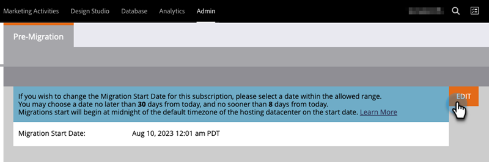
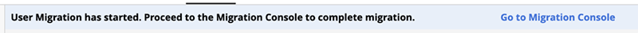
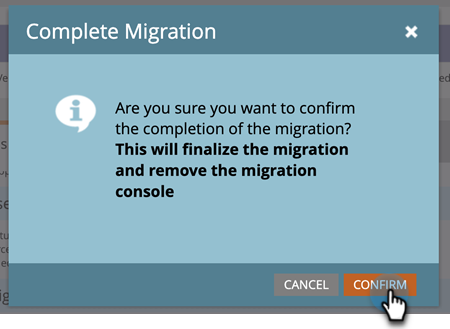

# Migración a Adobe Identity {#migrating-to-adobe-identity}

Cuando Adobe programa la migración de usuarios de una suscripción, los administradores de productos de Marketo Engage obtienen acceso a la consola de migración, que se encuentra en el menú de navegación del área de administración, en Integración.

## Premigración {#pre-migration}

Antes del inicio de la migración, un administrador puede modificar la fecha de inicio de la migración de los usuarios para su suscripción navegando a la pantalla Premigración en la consola de migración. Para cambiar la fecha, el administrador puede hacer clic en el botón **Editar**.

El administrador puede elegir una fecha entre 8 y 30 días en el futuro. Una vez seleccionada una fecha, el administrador debe hacer clic en **Guardar** para aplicar el cambio.

>[!NOTE]
>
>Para solicitar una fecha anterior a 8 días o posterior a 30, o si necesita ajustar la fecha después de que se bloquee la consola de premigración, envíe un correo electrónico a `marketocares@marketo.com`.

## Migraciones a Adobe Identity {#migrations-to-adobe-identity}

Todas las suscripciones de Marketo con zona horaria en los EE. UU. se migrarán a partir de la medianoche (hora estándar del Pacífico) de la fecha de inicio de la migración de usuarios. La migración de usuarios para todas las demás suscripciones comenzará a medianoche de la zona horaria especificada para la suscripción. Cuando comience la migración de usuarios de una suscripción, la administración de usuarios ya no estará disponible en el área de administración de Marketo y solo se logrará en Adobe Admin Console. La administración de funciones permanece en la pestaña Usuarios y funciones del área de administración de Marketo, así como la administración de usuarios local (solo API).

Adobe migrará automáticamente a todos los administradores de Marketo (con función de administrador estándar) con correos electrónicos verificados primero. Cuando los administradores de Marketo se migran a Adobe Identity, se añaden a Adobe Admin Console de la suscripción como administrador de productos para la suscripción de Marketo, se les asigna la función de administrador de productos de Adobe dentro de la aplicación de Marketo (junto con cualquier otra función que tuvieran anteriormente) y a su Adobe ID se le otorga derecho a la suscripción. Los administradores recibirán dos correos electrónicos. Uno indica que se le ha asignado como administrador de productos de Admin Console y el otro indica que su Adobe ID tiene derecho al producto de Marketo.

>[!IMPORTANT]
>
>Debe hacer clic en el botón **Aceptar invitación** del correo electrónico de asignación de derechos para acceder a Marketo Engage con su Adobe ID.

**Correo electrónico del administrador de productos de Marketo**

**Correo electrónico de asignación de derechos de Marketo**

**Si su suscripción a Marketo no tiene SSO en Marketo o en su organización de Adobe**, Adobe migrará automáticamente el resto de los usuarios. Este flujo de trabajo pretende ofrecer el máximo nivel de automatización y no se requiere ninguna acción para ejecutar la migración. Una vez finalizada la migración, la consola de migración de Marketo dejará de aparecer en el área de navegación de administración de Marketo y todos los usuarios accederán a Marketo mediante un Adobe ID.

**Si su suscripción de Marketo tiene SSO en Marketo o en su organización de Adobe**, los administradores de Marketo obtendrán acceso a la herramienta de migración de usuarios de autoservicio de la consola de migración cuando comience la migración de usuarios y se les avisará mediante un banner al iniciar sesión en la página Mi Marketo. El administrador será responsable de completar la migración de usuarios mediante la herramienta de migración de usuarios de autoservicio.

## Migración de usuarios de autoservicio de Marketo {#marketo-self-service-user-migration}

La herramienta Consola de migración de usuarios de autoservicio de Marketo consta de dos pestañas.

* **Pestaña Estado de migración**
* **Pestaña Migración de usuarios**

Existen tres pasos principales necesarios para completar una migración de autoservicio.

1. Migrar todos los usuarios elegibles deseados con direcciones de correo electrónico verificadas (pestaña Migración de usuarios)
1. Omitir todos los usuarios no elegibles y los usuarios elegibles no deseados (pestaña Migración de usuarios)
1. Una vez completados los pasos 1 y 2, complete la confirmación de migración (pestaña Estado de migración)

### Pestaña Estado de migración {#migration-status-tab}

La pestaña Estado de migración proporciona métricas generales sobre el progreso del requisito previo de verificación del correo electrónico de los usuarios, la migración y activación de los usuarios, y la finalización de la migración de la suscripción.

En la parte superior de Estado de migración, se muestran el vencimiento de la migración de suscripción y el botón para ampliarla. Encontrará más información sobre el vencimiento de la migración en la sección [Vencimiento de la migración de usuarios](#user-migration-expiration).

En la siguiente sección de la pestaña Estado de migración, hay dos barras de progreso. La primera barra de progreso muestra el progreso del proceso de verificación del correo electrónico del usuario. La segunda barra de progreso muestra el progreso del proceso de migración de usuarios.

A continuación puede ver las tres secciones del estado que se muestra al administrador.

* **Verificación de correo electrónico del usuario**: estado de la verificación de los usuarios de la suscripción.
* **Migración y activación de usuarios**: estado de la migración y activación de usuarios (migración y derechos al producto de Marketo Engage) de los usuarios de la suscripción.
* **Confirmación de migración**: estado de finalización de la migración de la suscripción.

#### Verificación de correo electrónico del usuario {#user-email-verification}

En la sección Verificación de correo electrónico del usuario, un administrador puede encontrar el estado actual de la verificación por correo electrónico de los usuarios de la suscripción, antes de la migración a Adobe Identity.

El administrador puede ver el estado de la verificación de correo electrónico de la suscripción, el porcentaje de usuarios de la suscripción que han completado la verificación del correo electrónico y el número de usuarios marcados como omitidos. El estado se notificará según el estado de verificación de correo electrónico de todos los usuarios de la suscripción. El administrador puede hacer clic en el número de usuarios omitidos para navegar a la pestaña Migración de usuarios y ver los usuarios omitidos.

El correo electrónico de verificación lo puede reenviar un administrador en la pestaña Migración de usuarios de la consola de migración y en la pestaña Usuarios y funciones del área de administración de Marketo, o el usuario en su Configuración de la cuenta. Al igual que los correos electrónicos de invitación de los usuarios, el vínculo del correo electrónico de verificación caduca en un plazo de tres días. Encontrará más información sobre la verificación del correo electrónico en [Comunidad](https://nation.marketo.com/) y en la [documentación de verificación del correo electrónico](/help/marketo/product-docs/administration/users-and-roles/email-verification.md).

>[!IMPORTANT]
>
>Si un usuario de Marketo Engage no verifica su dirección de correo electrónico, no se podrá migrar a un Adobe ID y perderá el acceso a la suscripción de Marketo una vez completada la migración. Para recuperar el acceso, un administrador de productos de Marketo tendría que añadirlos como nuevos usuarios.

#### Migración y activación del usuario {#user-migration-and-activation}

En la sección Migración y activación del usuario, un administrador puede encontrar el estado actual de la migración total de usuarios y los derechos para acceder al sistema de administración de identidades de Adobe.

Un administrador puede ver el porcentaje de usuarios de la suscripción que se han migrado a un Adobe ID o se han marcado como Omitido. Se informará del estado de la migración de todos los usuarios a un Adobe ID en la suscripción, o se marcará como omitido y no se migrará. A medida que se realiza la migración de los usuarios y se les asignan los derechos a Marketo Engage, o se omiten, el estado en cuestión se actualiza.

#### Confirmación de la migración {#migration-confirmation}

En la sección Confirmación de la migración, se solicitará a un administrador que confirme que se ha completado la migración de usuarios para la suscripción.

Una vez contabilizados todos los usuarios de la suscripción (migrados u omitidos), aparecerá el botón “Completar migración”.

El administrador que realice la migración tendrá que completar la confirmación de la migración haciendo clic en el botón **Completar migración**. El sistema les pedirá que **confirmen**.

Una vez confirmada la finalización de la migración de usuarios, la consola de migración se quitará del menú de navegación de Administración.

### Vencimiento de la migración de usuarios {#user-migration-expiration}

Adobe requiere que los clientes completen las migraciones de autoservicio en un plazo de 30 días. Si la fecha de vencimiento ha pasado, no se bloqueará la migración de usuarios ni la finalización de la migración a los administradores; sin embargo, solo podrán migrar usuarios bajo demanda. Si un administrador necesita más tiempo, puede ampliar la fecha de vencimiento de la suscripción.

Al hacer clic en el botón **Extender el vencimiento**, la fecha se actualizará a una semana después. Un administrador puede ampliar el vencimiento hasta tres veces.

Adobe se pondrá en contacto si la migración no se ha completado antes de la fecha de vencimiento.

### Pestaña Migración de usuarios {#user-migration-tab}

La pestaña Migración de usuarios proporciona a los administradores las herramientas para tener pleno control sobre la migración de usuarios.

Los administradores tienen la opción de hacer lo siguiente:

* Activar los correos electrónicos de verificación para los usuarios no verificados mediante el botón “Verificar correo electrónico”
* Omitir la migración de usuarios para aquellos usuarios que el administrador sabe que no pueden verificar su correo electrónico o que no lo harán, o que no deben migrarse mediante el botón “Omitir migración”
* Migrar a los usuarios seleccionados bajo demanda mediante el botón “Migrar ahora”
* Programar la migración de usuarios para los usuarios seleccionados para una fecha específica mediante el botón “Programar migración”
* Migrar a todos los usuarios elegibles bajo demanda (no es necesario seleccionar a los usuarios) mediante el botón “Migrar a todos los usuarios”

**Verificar correo electrónico**

Se requiere la verificación del correo electrónico para poder migrar a un usuario a un Adobe ID. Si hay usuarios que no hayan verificado su dirección de correo electrónico y que es necesario migrar, el administrador puede volver a enviar el correo electrónico de verificación al usuario. Al seleccionar un usuario no verificado, se habilita el botón “Verificar correo electrónico” para poder hacer clic en él.

Cuando el administrador haga clic en el botón **Verificar correo electrónico**, recibirá una notificación cuando se envíe el correo electrónico.

**Omitir migración y No omitir migración de usuarios**

Durante la migración de usuarios, todos los usuarios deben migrarse u omitirse. Adobe requiere el reconocimiento por parte de los administradores de que un usuario no se va a migrar, por eso es necesario que el administrador marque al usuario como omitido. Si el administrador no lo hace, no podrá confirmar la finalización de la migración de usuarios. Todos los usuarios omitidos perderán acceso a Marketo una vez que se complete la migración de usuarios.

>[!IMPORTANT]
>
>Un administrador debe omitir a todos los usuarios con correos electrónicos no verificados. Si hay usuarios que han verificado sus correos electrónicos, pero el administrador no desea migrarlos por algún motivo, deben marcarlos como omitidos.

Para omitir a un usuario, el administrador debe seleccionar al usuario o usuarios que desee. El botón “Omitir migración” se habilitará y se podrá hacer clic en él. Al hacer clic en el botón **Omitir migración**, la página se actualizará y el estado de verificación del usuario seleccionado y el estado de su migración se actualizará a “Omitido”.

Un administrador puede omitir la migración de un usuario omitido anteriormente si determina que es necesario migrar a ese usuario.

Para anular la omisión de un usuario, el administrador puede seleccionar al usuario que desee. El botón “No omitir migración” se habilitará y se podrá hacer clic en él. Al hacer clic en el botón **No omitir migración**, la página se actualiza.  El estado de verificación del usuario seleccionado se actualiza a su estado actual, ya sea “Verificado” o “No verificado”, y el estado de la migración del usuario se actualiza a “No iniciado”.

>[!NOTE]
>
>El botón “No omitir migración” solo está activo si todos los usuarios seleccionados tienen un estado de migración “Omitido”.

### Migración de usuarios de Marketo a Adobe ID {#migrating-marketo-users-to-adobe-ids}

Los administradores de productos de Marketo podrán seleccionar usuarios específicos para su migración por lotes, o seleccionar a todos los usuarios elegibles a la vez. Una vez seleccionados los usuarios, los administradores tienen la opción de “Migrar ahora” o “Programar migración” para una fecha posterior, lo que proporciona a los administradores la flexibilidad y el control sobre qué usuarios se van a migrar y cuándo. Los administradores también tienen la opción de “Migrar a todos los usuarios” de una suscripción.

Por ejemplo, un administrador puede seleccionar al grupo de “mejores usuarios” que desee migrar en primer lugar. Una vez que esas migraciones de usuarios se hayan completado correctamente, pueden seleccionar diferentes grupos de usuarios en función de variables como espacio de trabajo/empresa o función para realizar más migraciones de usuarios por lotes. O bien, pueden decidir migrar al resto de los usuarios de las suscripciones después de haber migrado correctamente el primer lote. El objetivo es proporcionar la mayor flexibilidad en el despliegue progresivo de Adobe ID a los usuarios.

Todas las migraciones de usuarios se producen simultáneamente y deben completarse correctamente en un plazo de sesenta segundos. Mientras se produce la migración de usuario para un usuario específico, ese usuario podría perder el acceso durante un máximo de un minuto, pero solo si el usuario había iniciado sesión en la aplicación. Una vez completada la migración de usuarios, el usuario recibirá un correo electrónico sobre cómo iniciar sesión en Marketo Engage con una identidad de Adobe. _Antes_ de iniciar sesión con un Adobe ID, el usuario debe aceptar primero la invitación mediante el botón de vínculo incluido en el correo electrónico. Las instrucciones sobre cómo iniciar sesión en Marketo Engage con un Adobe ID [están disponibles aquí](/help/marketo/product-docs/administration/marketo-with-adobe-identity/user-sign-in-with-adobe-id.md).

Las migraciones de usuarios se procesan de forma independiente, por lo que, si falla una migración de usuarios, Adobe seguirá procesando otras migraciones de usuarios. Si se produce un error de migración de usuario, el administrador no tiene que hacer nada. Se enviará al administrador una notificación por correo electrónico informándole del error y se le avisará de que Adobe está trabajando para resolver el problema inmediatamente. Si la migración de un usuario falla y ese usuario había iniciado sesión en Marketo Engage, el usuario podría perder el acceso durante un máximo de dos minutos mientras se vuelve a intentar la migración. Si la migración de un usuario falla, este puede seguir accediendo a Marketo Engage con su identidad de Marketo hasta que reciba una notificación por correo electrónico de que la migración se ha realizado correctamente y se le invite a iniciar sesión con un Adobe ID.

**Migrar ahora**

Un administrador puede seleccionar uno o varios usuarios para migrarlos bajo demanda. Esto activa la migración de los usuarios inmediatamente. Para migrar a uno o más usuarios, el administrador puede seleccionar los usuarios que desee y el botón “Migrar ahora” se habilita y se podrá hacer clic en él.

>[!NOTE]
>
>El botón “Migrar ahora” solo estará activo si el estado de verificación de todos los usuarios seleccionados es “Verificado”.

Al hacer clic en el botón **Migrar ahora**, el sistema le pide al administrador que confirme la migración de los usuarios seleccionados. Una vez que el administrador lo confirme, las migraciones de usuarios comenzarán a procesarse lo antes posible.

**Programar migración**

Un administrador puede seleccionar uno o varios usuarios para programar la migración en una fecha posterior. Para programar la migración de uno o más usuarios, el administrador selecciona a los usuarios deseados y el botón “Programar migración” se habilita y se puede hacer clic en él.

>[!NOTE]
>
>El botón “Migración programada” solo estará activo si el estado de verificación de todos los usuarios es “Verificado”, y el estado de migración es “No iniciado” o “Adobe ID creado”.

Al hacer clic en el botón **Programar migración**, el sistema pedirá al administrador que seleccione la fecha de migración que desee para los usuarios seleccionados. El administrador solo puede seleccionar fechas anteriores a la fecha de vencimiento de la migración de la suscripción. Cuando el administrador lo confirme, las migraciones de usuarios se programarán para que su procesamiento comience en la fecha seleccionada.

>[!NOTE]
>
>Todas las suscripciones de Marketo con zona horaria en los EE. UU. se migrarán a partir de la medianoche (hora estándar del Pacífico) de la fecha de inicio de la migración. La migración de usuarios para todas las demás suscripciones comenzará a medianoche de la zona horaria especificada para la suscripción.

**Migrar a todos los usuarios**

Un administrador puede seleccionar migrar a todos los usuarios elegibles de una suscripción, en cualquier momento. Esto activa la migración de los usuarios elegibles inmediatamente. Los usuarios elegibles son usuarios con correos electrónicos verificados que aún no se han migrado.

Al hacer clic en el botón **Migrar a todos los usuarios**, el sistema le pide al administrador que **confirme** la migración de todos los usuarios elegibles. Cuando el administrador lo confirme, las migraciones de usuarios comenzarán a procesarse lo antes posible.

