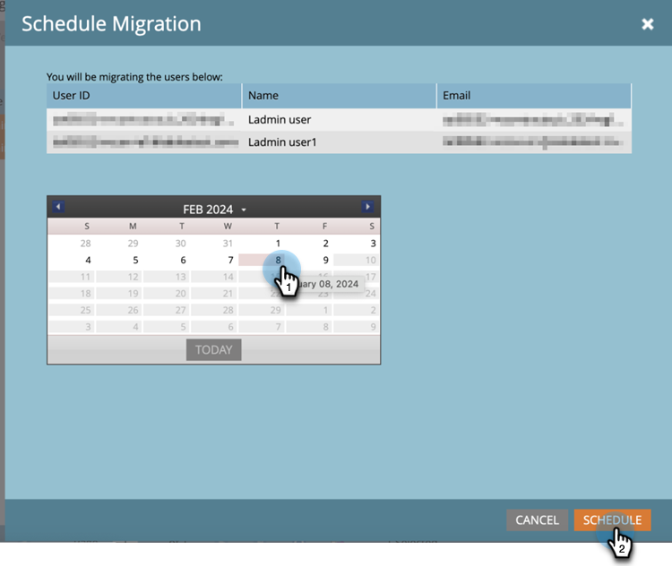

# Migración a Adobe Identity {#migrating-to-adobe-identity}

Cuando Adobe programa la migración de usuarios de una suscripción, los administradores de productos de Marketo Engage obtienen acceso a la consola de migración, que se encuentra en el menú de navegación del área Administración, en Integración.

## Premigración {#pre-migration}

Antes del inicio de la migración, un administrador puede modificar la fecha de inicio de la migración de los usuarios para su suscripción navegando a la pantalla Premigración en la consola de migración. Para cambiar la fecha, el administrador puede hacer clic en el botón **Editar**.

El administrador puede elegir una fecha entre 8 y 30 días en el futuro. Cuando se selecciona una fecha, el administrador debe hacer clic en **Guardar** para realizar el cambio.

>[!NOTE]
>
>Para solicitar una fecha anterior a 8 días o posterior a 30, o si necesita ajustar la fecha después de que se bloquee la consola de premigración, envíe un correo electrónico a `marketocares@marketo.com`.

## Migraciones a Adobe Identity {#migrations-to-adobe-identity}

Todas las suscripciones de Marketo con una zona horaria de EE. UU. se migrarán a partir de la medianoche (hora estándar del Pacífico) de la fecha de inicio de la migración de usuarios. La migración de usuarios para todas las demás suscripciones comenzará a medianoche del huso horario especificado de la suscripción. Cuando comience la migración de usuarios de una suscripción, la administración de usuarios ya no estará disponible en el área de Administración de Marketo y solo se logrará en Adobe Admin Console. La administración de funciones permanece en la pestaña Usuarios y funciones del área de Administración de Marketo, así como la administración de usuarios local (solo API).

Adobe migrará automáticamente a todos los administradores de Marketo (con una función de administrador estándar) con correos electrónicos verificados primero. Cuando los administradores de Marketo se migran a Adobe Identity, se añaden a Adobe Admin Console de la suscripción como administrador de productos para la suscripción de Marketo, se les asigna la función de administrador de productos de Adobe dentro de la aplicación de Marketo (junto con cualquier otra función que tuvieran anteriormente) y se da derecho a su Adobe ID a la suscripción. Los administradores recibirán dos correos electrónicos. Uno indica que se le ha asignado como administrador de productos de Admin Console y el otro indica que su Adobe ID tiene derecho al producto de Marketo.

>[!IMPORTANT]
>
>Debe hacer clic en el botón **Aceptar invitación** del correo electrónico de asignación de derechos para acceder a Marketo Engage con su Adobe ID.

**Correo electrónico del administrador de productos Marketo**

**Correo electrónico de derecho de Marketo**

**Si su suscripción a Marketo no tiene SSO en Marketo o en su organización de Adobe**, Adobe migrará automáticamente al resto de los usuarios. Este flujo de trabajo pretende ofrecer el máximo nivel de automatización y no se requiere ninguna acción para ejecutar la migración. Una vez finalizada la migración, la consola de migración de Marketo dejará de aparecer en el área de navegación de Administración de Marketo y todos los usuarios accederán a Marketo mediante un Adobe ID.

**Si su suscripción de Marketo tiene SSO en Marketo o en su organización de Adobe**, los administradores de Marketo obtendrán acceso a la herramienta de migración de usuarios de autoservicio de la consola de migración cuando comience la migración de usuarios y se les avisará mediante un banner al iniciar sesión en la página Mi Marketo. El administrador será responsable de completar la migración de usuarios mediante la herramienta de migración de usuarios de autoservicio.

## Migración de usuarios de autoservicio de Marketo {#marketo-self-service-user-migration}

La herramienta Consola de migración de usuarios de autoservicio de Marketo consta de dos pestañas.

* **Ficha Estado de la migración**
* **Ficha Migración de usuarios**

Existen tres pasos principales necesarios para completar una migración de autoservicio.

1. Migrar todos los usuarios aptos verificados con direcciones de correo electrónico deseados (ficha Migración de usuarios)
1. Omitir todos los usuarios no aptos y los usuarios aptos no deseados (pestaña Migración de usuarios)
1. Una vez completados los pasos 1 y 2, complete la confirmación de migración (pestaña Estado de la migración)

### Pestaña Estado de migración {#migration-status-tab}

La pestaña Estado de la migración proporciona métricas generales sobre el progreso del requisito previo de verificación por correo electrónico de los usuarios, la migración y activación de los usuarios y la finalización de la migración de la suscripción.

En la parte superior de Estado de la migración, se muestra la caducidad de la migración de la suscripción y el botón para ampliarla. Encontrará más información sobre la caducidad de la migración en la sección [Caducidad de la migración de usuarios](#user-migration-expiration).

En la siguiente sección de la pestaña Estado de la migración, hay dos barras de progreso. La primera barra de progreso es mostrar la progresión de la finalización de la verificación del correo electrónico del usuario. La segunda barra de progreso muestra la progresión de la finalización de la migración del usuario.

A continuación, se muestran tres secciones del estado al administrador.

* **Verificación por correo electrónico del usuario**: estado de verificación de los usuarios de la suscripción.
* **Migración de usuarios y activación**: migración de usuarios y activación (migración y derechos al producto Marketo Engage) de los usuarios de la suscripción.
* **Confirmación de migración**: estado de finalización de la migración de la suscripción.

#### Verificación de correo electrónico del usuario {#user-email-verification}

En la sección Verificación por correo electrónico del usuario, un administrador puede encontrar el estado actual de la verificación por correo electrónico de los usuarios de la suscripción, antes de la migración a Adobe Identity.

Un administrador puede ver el estado de verificación por correo electrónico de la suscripción, el porcentaje de usuarios de la suscripción que han completado la verificación por correo electrónico y el número de usuarios que se han marcado como omitidos. El estado se notificará según el estado de verificación por correo electrónico de todos los usuarios en la suscripción. El administrador puede hacer clic en el número de usuarios omitidos y se desplazará a la pestaña Migración de usuarios para ver los usuarios omitidos.

El correo electrónico de verificación lo puede reenviar un administrador en la pestaña Migración de usuarios de la Consola de migración y en la pestaña Usuarios y funciones del área Administración de Marketo, o el usuario en su Configuración de cuenta. Al igual que los correos electrónicos de invitación de los usuarios, el vínculo del correo electrónico de verificación caduca en tres días. Encontrará más información sobre la verificación por correo electrónico en [Comunidad](https://nation.marketo.com/) y en [documentación de verificación por correo electrónico](/help/marketo/product-docs/administration/users-and-roles/email-verification.md).

>[!IMPORTANT]
>
>Si un usuario de Marketo Engage no comprueba su dirección de correo electrónico, no puede migrarse a una Adobe ID y perderá el acceso a la suscripción de Marketo una vez completada la migración. Para recuperar el acceso, un administrador de productos de Marketo tendría que agregarlos como un nuevo usuario.

#### Activación y migración de usuarios {#user-migration-and-activation}

En la sección Activación y migración de usuarios, un administrador puede encontrar el estado actual de la migración total de usuarios y las autorizaciones para acceder a Adobe Identity Management System.

Un administrador puede ver el porcentaje de usuarios de su suscripción que se han migrado a un Adobe ID o marcado como Omitido. Se informará del estado una vez que todos los usuarios hayan migrado su estado a una Adobe ID incluida en la suscripción o se marcará como Omitido y no se migrará. A medida que los usuarios se migran y tienen derecho a Marketo Engage, o se omiten, este estado se actualiza.

#### Confirmación de migración {#migration-confirmation}

En la sección Confirmación de migración, se solicitará a un administrador que confirme que se ha completado la migración de usuarios para la suscripción.

Una vez contabilizados todos los usuarios de la suscripción (migrados u omitidos), aparecerá el botón &#39;Completar migración&#39;.

El administrador que realice la migración tendrá que completar la confirmación de la migración haciendo clic en el botón **Completar migración**. Se les pedirá que **confirmen**.

Una vez confirmada la finalización de la migración de usuarios, la consola de migración se eliminará del menú de navegación de Administración.

### Caducidad de migración de usuarios {#user-migration-expiration}

Adobe requiere que los clientes completen las migraciones de autoservicio en un plazo de 30 días. No se bloqueará la migración de usuarios ni la finalización de la migración de los administradores si la fecha de caducidad ha pasado. Sin embargo, solo podrán migrar usuarios bajo demanda. Si un administrador necesita más tiempo, puede ampliar la fecha de caducidad de la suscripción.

Al hacer clic en el botón **Extender caducidad**, la fecha se actualizará a una semana después. Un administrador puede ampliar su caducidad hasta tres veces.

Adobe se pondrá en contacto si no completa la migración antes de la fecha de caducidad.

### Pestaña Migración de usuarios {#user-migration-tab}

La pestaña Migración de usuarios proporciona a los administradores las herramientas para tener un control total de la migración de usuarios.

Los administradores tienen la opción de:

* Déclencheur de correos electrónicos de verificación para usuarios no verificados mediante el botón Verificar correo electrónico
* Omitir la migración de usuarios para usuarios que el administrador sabe que pueden o no verificar su correo electrónico o que no deben migrarse mediante el botón Omitir migración
* Migrar usuarios seleccionados bajo demanda mediante el botón &#39;Migrar ahora&#39;
* Programar la migración de usuarios para los usuarios seleccionados para una fecha específica mediante el botón &quot;Programar migración&quot;
* Migrar todos los usuarios elegibles bajo demanda (no se necesita selección de usuarios) mediante el botón &#39;Migrar todos los usuarios&#39;

**Verificar correo electrónico**

Se requiere la verificación por correo electrónico para migrar un usuario a una Adobe ID. Si hay usuarios que no han comprobado su dirección de correo electrónico y necesitan migrarse, el administrador puede almacenar en déclencheur el correo electrónico de verificación para enviarlo de nuevo al usuario. Al seleccionar un usuario no verificado, se podrá hacer clic en el botón &quot;Verificar correo electrónico&quot;.

Cuando el administrador haga clic en el botón **Verificar correo electrónico**, recibirá una notificación cuando se envíe el correo electrónico.

**Omitir y anular la migración de usuarios**

Durante la migración de usuarios, todos los usuarios deben migrarse u omitirse. Adobe requiere que los administradores reconozcan que un usuario no se migrará y que un administrador lo marque como omitido. Si el administrador no lo hace, no podrá confirmar la finalización de la migración de usuarios. Todos los usuarios omitidos perderán acceso a Marketo una vez que se complete la migración de usuarios.

>[!IMPORTANT]
>
>Un administrador debe omitir todos los usuarios con correos electrónicos no verificados. Si hay usuarios que han verificado sus correos electrónicos, pero el administrador no desea migrarlos por ningún motivo, deben marcarlos como omitidos.

Para omitir un usuario, el administrador puede seleccionar los usuarios deseados. Se podrá hacer clic en el botón Omitir migración. Al hacer clic en el botón **Omitir migración**, la página se actualizará y el estado de verificación y migración del usuario seleccionado se actualizará a &#39;Omitido&#39;.

Un administrador puede anular la omisión de un usuario omitido anteriormente si determina que es necesario migrar el usuario.

Para anular la omisión de un usuario, el administrador puede seleccionar el usuario que desee. Se podrá hacer clic en el botón &quot;Anular migración&quot;. Al hacer clic en el botón **Anular la migración**, la página se actualizará.  El estado de verificación del usuario seleccionado se actualizará a su estado actual, ya sea &quot;Verificado&quot; o &quot;No verificado&quot;, y el estado de migración del usuario se actualizará a &quot;No iniciado&quot;.

>[!NOTE]
>
>El botón &quot;Anular omisión de migración&quot; solo estará activo si todos los usuarios seleccionados tienen un estado de migración &quot;Omitido&quot;.

### Migración de usuarios de Marketo a Adobe ID {#migrating-marketo-users-to-adobe-ids}

Los administradores de productos de Marketo podrán seleccionar usuarios para migrar en lotes o todos los usuarios aptos a la vez. Una vez seleccionados los usuarios, los administradores tienen la opción de &quot;Migrar ahora&quot; o &quot;Programar migración&quot; para una fecha posterior, lo que proporciona a los administradores flexibilidad y control sobre qué usuarios se migran y cuándo. Los administradores también tienen la opción de &quot;Migrar todos los usuarios&quot; en una suscripción.

Por ejemplo, un administrador puede seleccionar el grupo de &quot;usuarios avanzados&quot; que desea migrar en primer lugar. Una vez que esas migraciones de usuarios se completan correctamente, pueden seleccionar diferentes grupos de usuarios en función de variables como espacio de trabajo/empresa o función/función para realizar más migraciones de usuarios por lotes de. O bien, pueden decidir migrar al resto de los usuarios en las suscripciones después del éxito del primer lote. El objetivo es proporcionar la mayor flexibilidad a la hora de implementar Adobe ID para los usuarios.

Todas las migraciones de usuarios se producen simultáneamente y deben completarse correctamente en un plazo de sesenta segundos. Mientras se produce la migración de un usuario para un usuario específico, el usuario puede perder el acceso durante un máximo de 1 minuto, y eso solo si el usuario ha iniciado sesión en la aplicación. Una vez completada la migración de usuarios, el usuario recibirá un correo electrónico sobre cómo iniciar sesión en Marketo Engage con una identidad de Adobe. El usuario debe aceptar la invitación a través del vínculo de botón del correo electrónico _antes de_ que pueda iniciar sesión con un Adobe ID. Las instrucciones sobre cómo iniciar sesión en Marketo Engage con un Adobe ID [se encuentran aquí](/help/marketo/product-docs/administration/marketo-with-adobe-identity/user-sign-in-with-adobe-id.md).

Las migraciones de usuarios se procesan de forma independiente, por lo que si falla una migración de usuarios, Adobe seguirá procesando otras migraciones de usuarios. Si se produce un error de migración de usuario, un administrador no requiere ninguna acción. Se enviará al administrador una notificación por correo electrónico sobre el error y se le avisará de que Adobe está trabajando para resolver el problema inmediatamente. Si la migración de un usuario falla y ese usuario ha iniciado sesión en Marketo Engage, el usuario puede perder el acceso durante un máximo de dos minutos mientras se producen reintentos de migración. Si la migración de un usuario falla, el usuario puede seguir accediendo a Marketo Engage con su identidad de Marketo hasta que reciba una notificación por correo electrónico de que la migración se ha realizado correctamente y se le invite a iniciar sesión con un Adobe ID.

**Migrar ahora**

Un administrador puede seleccionar uno o varios usuarios para migrar bajo demanda. Esto almacenará en déclencheur la migración de los usuarios inmediatamente. Para migrar uno o más usuarios, el administrador puede seleccionar los usuarios deseados y el botón &#39;Migrar ahora&#39; estará disponible.

>[!NOTE]
>
>El botón &quot;Migrar ahora&quot; solo estará activo si todos los usuarios seleccionados tienen un estado de verificación &quot;Verificado&quot;.

Al hacer clic en el botón **Migrar ahora**, se le pedirá al administrador que confirme la migración de los usuarios seleccionados. Una vez que el administrador lo confirme, las migraciones de usuarios comenzarán a procesarse lo antes posible.

**Programar migración**

Un administrador puede seleccionar uno o varios usuarios para programar la migración en una fecha posterior. Para programar la migración de uno o más usuarios, el administrador selecciona los usuarios deseados y se puede hacer clic en el botón &quot;Programar migración&quot;.

>[!NOTE]
>
>El botón &quot;Migración programada&quot; solo estará activo si todos los usuarios tienen un estado de verificación de &quot;Verificado&quot; y un estado de migración de &quot;No iniciado&quot; o &quot;Adobe ID creado&quot;.

Al hacer clic en el botón **Programar migración**, se le pedirá al administrador que seleccione la fecha de migración deseada de los usuarios seleccionados. El administrador solo puede seleccionar fechas antes de la fecha de caducidad de la migración de la suscripción. Cuando el administrador lo confirme, las migraciones de usuarios se programarán para comenzar a procesarse en la fecha seleccionada.

>[!NOTE]
>
>Todas las suscripciones de Marketo con una zona horaria de EE. UU. se migrarán a partir de la medianoche (hora estándar del Pacífico) de la fecha de inicio de la migración. La migración de usuarios para todas las demás suscripciones comenzará a medianoche del huso horario especificado de la suscripción.

**Migrar todos los usuarios**

Un administrador puede seleccionar migrar a todos los usuarios aptos de una suscripción, en cualquier momento. Esto almacenará en déclencheur la migración de los usuarios aptos inmediatamente. Los usuarios aptos son usuarios con correos electrónicos verificados que aún no se han migrado.

Al hacer clic en el botón **Migrar todos los usuarios**, se le pedirá al administrador que **confirme** la migración de todos los usuarios aptos. Cuando el administrador lo confirme, las migraciones de usuarios comenzarán a procesarse lo antes posible.

