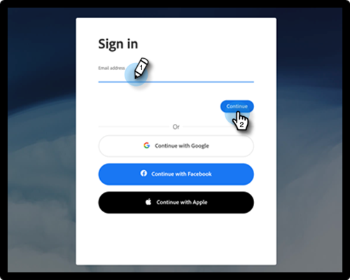

# Inicio de sesión de usuario con Adobe ID {#user-sign-in-with-adobe-id}

Cuando un usuario con identidad de Adobe necesita iniciar sesión en la aplicación de Marketo Engage, debe hacerlo mediante el vínculo de inicio de sesión de Adobe ID en lugar del inicio de sesión habitual en la página de inicio de sesión de Marketo Engage. Al hacer clic en el vínculo, se dirige al usuario a la aplicación de Marketo Engage.

1. Haga clic en **[!UICONTROL Continuar con Adobe ID]** en la página de inicio de sesión de Marketo Engage.

   

1. Introduzca sus credenciales de Adobe y haga clic en **[!UICONTROL Continuar]**.

   

Una vez que el inicio de sesión se haya realizado correctamente, se le redirigirá a la aplicación de Marketo Engage.
