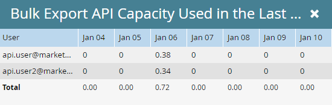

# Información sobre la API de exportación masiva {#bulk-export-api-information}

Aprenda a comprobar cuánta capacidad de la API de extracción masiva [1&rbrace; ha usado su instancia de Marketo Engage en los últimos siete días.](https://experienceleague.adobe.com/en/docs/marketo-developer/marketo/rest/bulk-extract/bulk-extract){target="_blank"}

>[!NOTE]
>
>Si necesita capacidad adicional, póngase en contacto con su representante de cuentas.

1. Vaya al área de **[!UICONTROL Admin]**.

   

1. Haga clic en **[!UICONTROL Servicios web]**.

   

1. Desplácese hacia abajo hasta la tarjeta Información de API de exportación masiva. Haga clic en el número junto a &quot;Últimos 7 días&quot; para ver el uso por día/usuario de API.

   

   

>[!NOTE]
>
>La asignación de la instancia de Marketo Engage se restablece diariamente a las 12:00 a.m. CST.
