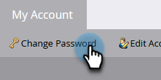

# Cambiar la contraseña de Marketo {#change-your-marketo-password}

Cambie la contraseña de Marketo siguiendo estos sencillos pasos.

1. Vaya a la **[!UICONTROL Administrador]** área.

   

1. Clic **[!UICONTROL Mi cuenta]**.

   

1. Clic **[!UICONTROL Cambiar contraseña]**.

   

1. Introduzca la contraseña anterior y la nueva contraseña y haga clic en **[!UICONTROL Guardar]**.

   

   >[!NOTE]
   >
   >Tome nota de los requisitos de la contraseña cuando realice la actualización.
