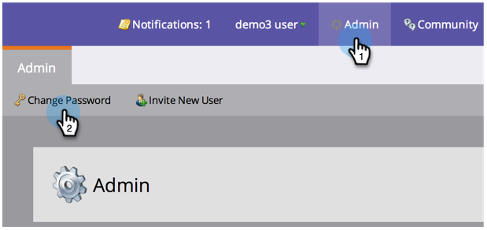

# Cambiar la contraseña de Marketo {#change-your-marketo-password}

Cambie la contraseña de Marketo siguiendo estos sencillos pasos.

1. Cualquier usuario de Marketo puede hacer clic en su nombre y en **Mi cuenta**.

   

1. Los administradores también pueden hacer clic en **Administración** y luego en **Cambiar contraseña** para cambiar su contraseña de administrador.

   

1. Introduzca la contraseña antigua y la nueva contraseña y, a continuación, haga clic en **Guardar** cuando la nueva contraseña se ajuste a todos los requisitos.

   

   ¡Manténlo en secreto! ¡Mantenlo a salvo!

   >[!TIP]
   >
   >¿Qué es una buena contraseña? Algo largo con muchas letras, números y símbolos como &quot;M@rk3to !$ Gre@t&quot;. Excepto, no ese. Sé creativo y haz lo tuyo propio.
