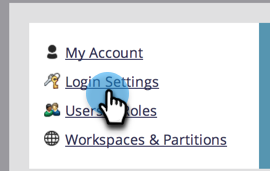

# Cambiar la configuración de seguridad de la contraseña {#change-your-password-security-settings}

Controle la política de contraseñas de su suscripción. Así es cómo se hace.

>[!NOTE]
>
>**Se requieren permisos de administrador**

1. Vaya al área de **[!UICONTROL Admin]**.

   

1. Haga clic en **[!UICONTROL Configuración de inicio de sesión]**.

   

1. En **[!UICONTROL Configuración de seguridad]**, haga clic en **[!UICONTROL Editar]**.

   

1. Seleccione una **[!UICONTROL plantilla]**. Para obtener opciones avanzadas, haga clic en la lista desplegable **[!UICONTROL Avanzadas]**.

   

   >[!NOTE]
   >
   >Una plantilla es solo una configuración prediseñada. **[!UICONTROL Seguridad estándar]** es correcta. **[!UICONTROL Alta seguridad]** es la más fuerte. **[!UICONTROL Personalizado]** le permite crear el suyo propio.

   >[!TIP]
   >
   >En **[!UICONTROL Personalizado]**, marque las casillas para indicar qué características desea que incluyan los usuarios cuando creen contraseñas.

1. Establezca la **[!UICONTROL caducidad]**. Esta función requiere automáticamente que los usuarios restablezcan sus contraseñas después de un tiempo determinado. Esto también incluye al usuario administrador.

   

   >[!CAUTION]
   >
   >Los cambios no se notificarán a los usuarios existentes. Establezca **[!UICONTROL Caducidad]** en 30 días primero para asegurarse de que todos se han actualizado a la nueva configuración y, a continuación, vuelva a cambiar esta configuración a su cadencia original.

1. Establezca **[!UICONTROL Tiempo de espera de sesión inactivo]**. Esto determina cuánto tiempo puede estar inactivo un usuario antes de que tenga que volver a iniciar sesión en Marketo.

   
