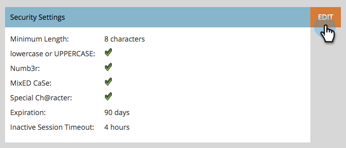

# Cambiar la configuración de seguridad de contraseña {#change-your-password-security-settings}

Controle la política de contraseñas de su suscripción. Así es como.

>[!NOTE]
>
>**Permisos de administración necesarios**

1. Vaya a la **[!UICONTROL Administrador]** área.

   

1. Clic **[!UICONTROL Configuración de inicio]**.

   

1. En **[!UICONTROL Configuración de seguridad]**, haga clic en **[!UICONTROL Editar]**.

   

1. Seleccione una **[!UICONTROL Plantilla]**. Para ver las opciones avanzadas, haga clic en **[!UICONTROL Avanzadas]** menú desplegable.

   

   >[!NOTE]
   >
   >Una plantilla es solo una configuración prediseñada. Estándar es bueno. Alta seguridad es la más fuerte. Personalizado le permite crear su propio.

   >[!TIP]
   >
   >Entrada **[!UICONTROL Personalizado]**, marque las casillas para indicar qué características desea que incluyan los usuarios cuando creen contraseñas.

1. Configure las variables **[!UICONTROL Caducidad]**. Esta función requiere automáticamente que los usuarios restablezcan sus contraseñas después de un tiempo determinado. Esto también incluye al usuario administrador.

   

   >[!CAUTION]
   >
   >Los cambios no se notificarán a los usuarios existentes. Establecer **[!UICONTROL Caducidad]** primero, cambie a 30 días para asegurarse de que todos se han actualizado a la nueva configuración y, a continuación, vuelva a cambiar esta cadencia a la original.

1. Configure las variables **[!UICONTROL Tiempo de espera de sesión inactivo]**. Esto determina cuánto tiempo puede estar inactivo un usuario antes de que tenga que volver a iniciar sesión en Marketo.

   
