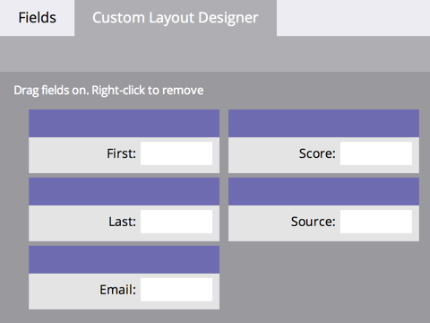
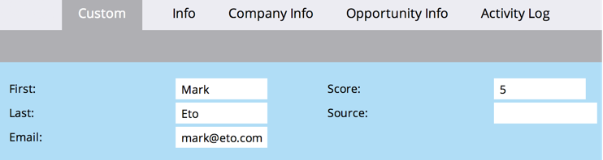

# Creación de una pestaña personalizada para la página de detalles de la persona {#creating-a-custom-tab-for-the-person-detail-page}

Si busca un conjunto específico de campos en los detalles de la persona una y otra vez, plantéese crear un diseño personalizado para facilitar las cosas.

1. Vaya al área de **[!UICONTROL Admin]**.

   

1. Haga clic en **[!UICONTROL Administración de campos]**.

   

1. Haga clic en la ficha **[!UICONTROL Designer de diseño personalizado]**.

   

1. Busque el campo que desee agregar y, a continuación, arrástrelo y suéltelo en el lienzo.

   

1. Siga agregando campos hasta que tenga el diseño del modo que desee.

   

   >[!NOTE]
   >
   >Tiene dos columnas para trabajar.

   Si decide quitar un campo, haga clic con el botón secundario en el campo que desee quitar y haga clic en **[!UICONTROL Eliminar]**.

   

   ¡Increíble trabajo! Ahora, al cargar los detalles de una persona, puede utilizar su diseño personalizado para acceder a la información importante para usted.

   
