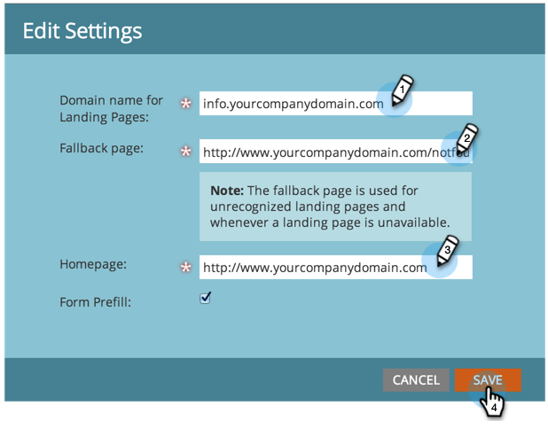

# Personalizar las direcciones URL de su página de aterrizaje con un CNAME (administración) {#customize-your-landing-page-urls-with-a-cname-administration}

Aunque Marketo aloje sus páginas de aterrizaje, la dirección URL debe personalizarse para su empresa.

>[!NOTE]
>
>Sin CNAME:
>
>https://na-sj02.marketo.com/lp/mktodemoaccount126/UnsubscribePage.html
>
>CNAME de marca:
>
>https://go.**YourCompany**.com/UnsuscribePage.html

>[!NOTE]
>
>**Se requieren permisos de administrador**

¡Vamos a ponerte en marcha!

1. Elija un CNAME.

   Es la parte frontal de la URL. Ejemplos:

   * **vaya**.YourCompany.com/NameOfPage.html
   * **información**.YourCompany.com/NameOfPage.html
   * **páginas**.YourCompany.com/NameOfPage.html

   La palabra (más YourCompany.com) se denomina CNAME. Necesitará esto más tarde, así que tenga en cuenta.

1. Busque la cadena de cuenta.

1. Vaya al área **Admin** y haga clic en **Páginas de aterrizaje**.

   

1. En la ficha **Páginas de aterrizaje**, copie la cadena de cuenta en la sección Configuración .

   

1. También lo necesitará más tarde, así que tenga en cuenta.

1. Envíe la solicitud a TI.

1. Pida a su personal de TI que configure el siguiente CNAME (reemplace la palabra [CNAME] y [CADENA DE CUENTA] por el texto del paso anterior):

   [CNAME].YourCompany.com >  [CADENA DE CUENTA].mkToweb.com

1. Completar la configuración de CNAME.

1. Una vez que su TI haya creado el CNAME, vaya a **Admin** y haga clic en **Páginas de aterrizaje**.

   

1. En la sección **Settings**, haga clic en **Edit**.

   

1. Introduzca su CNAME en **Domain name for Landing Pages**, introduzca su **Fallback page**, introduzca su **Homepage** y haga clic en **Save**.

   

En la página de reserva se redirigirá a las personas si la página de aterrizaje de Marketo no está disponible.

¡Buen trabajo! Las páginas de aterrizaje ahora tienen marca con el dominio de la empresa.
