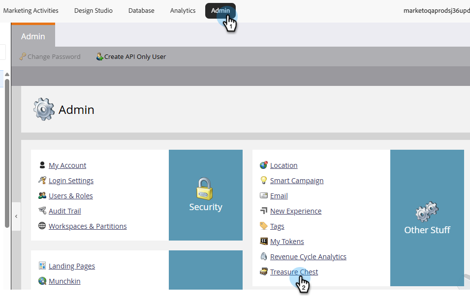

# Deshabilitar campañas inteligentes en archivo {#disable-smart-campaigns-on-archive}

Cuando esta función está habilitada, el archivado de una carpeta o programa desactiva automáticamente sus campañas para evitar actividades inesperadas.

Cuando se archiva una carpeta o un programa, o cuando se mueve una campaña inteligente activa a una carpeta que ya está archivada, Marketo Engage detiene la ejecución de las campañas afectadas:

* Se han desactivado **campañas activadas**.
* Se han cancelado las ejecuciones pendientes de **campañas por lotes**.
* **Las campañas ejecutables** no tienen estado de ejecución, por lo que no se realiza ninguna acción.

## Cómo habilitar {#how-to-enable}

1. En la sección **Administrador**, haga clic en **Cofre del tesoro**.

   

1. Desplácese a _Deshabilitar campañas inteligentes en el archivo_ y haga clic en **Editar**.

   

1. Seleccione la casilla **Habilitado** y haga clic en **Guardar**.

   

<table>
  <tr>
    <td><b>Habilitado (seleccionado)</b></td>
    <td>El archivado desactiva todas las campañas, según las reglas anteriores.</td>
  </tr>
  <tr>
    <td><b>Desactivado (sin marcar)</b></td>
    <td>El archivado de una carpeta o programa sigue funcionando, pero las campañas se dejan en ejecución o se programan tal cual.</td>
  </tr>
</table>

>[!IMPORTANT]
>
>Después de cambiar esta configuración, debe actualizar el explorador para que el cambio surta efecto.

## Acciones compatibles

Las siguientes acciones desactivan las campañas cuando _Deshabilitar campañas inteligentes en el archivo_ está habilitado:

* Arrastrando y soltando una **carpeta** que contiene campañas activas en una carpeta archivada
* Arrastrando y soltando un **programa** (de cualquier tipo) que contenga campañas activas en una carpeta archivada
* Arrastrando y soltando **una sola campaña inteligente** en una carpeta archivada
* Haciendo clic con el botón derecho en **Mover** de una sola campaña inteligente a una carpeta archivada
* Haciendo clic con el botón derecho en **Mover carpeta** en una carpeta que contenga campañas activas a una carpeta archivada
* Haciendo clic con el botón derecho en **Mover** un programa que contenga campañas activas a una carpeta archivada
* Haciendo clic con el botón derecho en **Convertir en carpeta archivada** en una carpeta para archivarla sin moverla

>[!NOTE]
>
>Si se hace referencia a una campaña inteligente dentro de la carpeta o del programa que se está archivando en otra parte (por ejemplo, a través del paso de flujo &quot;Solicitar campaña&quot;), el archivado se bloquea para evitar que se interrumpa esa otra campaña.
