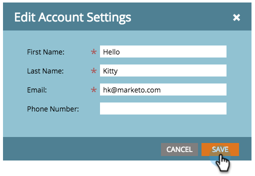

# Editar configuración de cuenta {#edit-account-settings}

¿Necesita cambiar la dirección de correo electrónico, el nombre o el número de teléfono de la cuenta? Aprenda cómo se muestra a continuación.

>[!NOTE]
>
>**Se requieren permisos de administrador**

1. Vaya a la **Administrador** .

   

1. Select **Mi cuenta**.

   

1. Select **Editar configuración de cuenta**.

   

1. Realice las ediciones y haga clic en **Guardar**.

   

   ¡Ta-da! Información actualizada.
