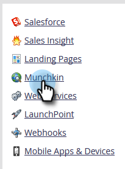

# Editar la configuración de compatibilidad con el explorador &quot;No rastrear&quot; {#edit-do-not-track-browser-support-settings}

&quot;No rastrear&quot; es una solicitud del explorador para no rastrearse en sistemas como Marketo. Puede cumplir esa solicitud siguiendo estos pasos.

>[!NOTE]
>
>**Se requieren permisos de administración**

>[!NOTE]
>
>&quot;No rastrear&quot; se establecerá en **[!UICONTROL Omitir]** de forma predeterminada, por lo que si eso es lo que desea, no necesita realizar ningún paso.

1. Haga clic en **[!UICONTROL Administrador]**.

   

1. Haga clic en **[!UICONTROL Munchkin]**.

   

1. En **[!UICONTROL Seguimiento de personas]**, haga clic en **[!UICONTROL Editar]**.

   

1. Seleccione **[!UICONTROL Asistencia]** y haga clic en **[!UICONTROL Guardar]**.

   

   Después de guardar los cambios, verá la actualización.

   

   >[!NOTE]
   >
   >La práctica recomendada es admitir la función &quot;No rastrear&quot;. ¡En Europa, es la ley!

   >[!TIP]
   >
   >Para obtener más información sobre &quot;No rastrear&quot; y cómo funciona, visita [esta página](https://en.wikipedia.org/wiki/Do_Not_Track).
