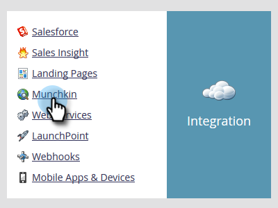

# Editar la configuración de compatibilidad con navegadores &quot;No rastrear&quot; {#edit-do-not-track-browser-support-settings}

&quot;No rastrear&quot; es una solicitud del explorador para que no se rastree en sistemas como Marketo. Puede aceptar esa solicitud con los pasos siguientes.

>[!NOTE]
>
>**Se requieren permisos de administrador**

>[!NOTE]
>
>&quot;No rastrear&quot; se establecerá en Ignorar de forma predeterminada, por lo que si eso es lo que desea, no tendrá que realizar ningún paso.

1. Haga clic en **Administrador**.

   

1. Haga clic en **Munchkin**.

   

1. En **Seguimiento de personas**, haga clic en **Editar**.

   

1. Select **Asistencia** y haga clic en **Guardar**.

   

   Después de guardar los cambios, verá la actualización.

   

   >[!NOTE]
   >
   >Una práctica recomendada es admitir la función &quot;No rastrear&quot;. En Europa, ¡es la ley!

   >[!TIP]
   >
   >Para obtener más información sobre &quot;No rastrear&quot; y cómo funciona, visite [esta página](https://en.wikipedia.org/wiki/Do_Not_Track).
