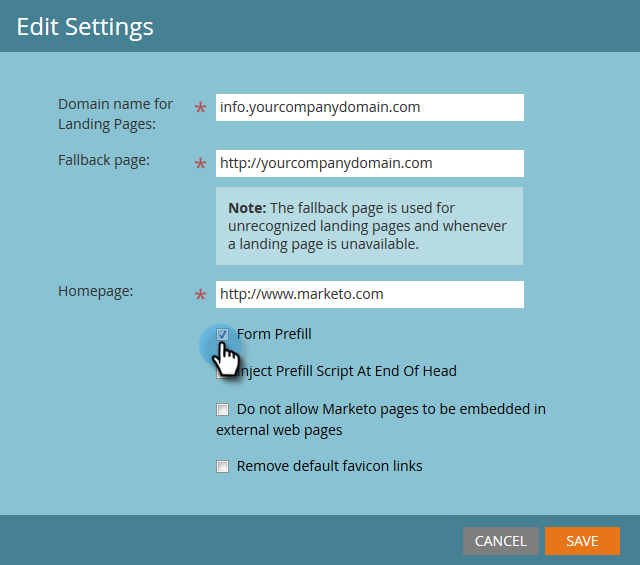

# Editar configuración de Página de aterrizaje {#edit-landing-page-settings}

Puede editar el nombre de dominio y la página de reserva, activar o desactivar el cumplimentado previo del formulario, evitar el uso indebido de la página de aterrizaje, etc. Así es como.

>[!NOTE]
>
>**Se requieren permisos de administración**

1. En **Administración**, haga clic en **Páginas de aterrizaje**.

   

1. En la sección **Páginas de aterrizaje**, haga clic en **Editar**.

   

1. Escriba la información de su dominio y página.

   | Término | Definición |
   |---|---|
   | Nombre de dominio para páginas de aterrizaje | Este es su CNAME. Un CNAME es la primera parte de la URL que se proporciona a las personas para páginas de aterrizaje. Por ejemplo, en `https://go.yourCompany.com`, la palabra &quot;go&quot; es el CNAME. Se pueden tener múltiples, pero la mayoría de la gente simplemente usa uno. |
   | Página de reserva | Aquí es a dónde ir si la página de aterrizaje no existe o no está. Obtenga más información sobre [páginas de reserva](/help/marketo/product-docs/administration/settings/set-a-fallback-page.md). |
   | Página principal | Introduzca la dirección URL del sitio corporativo. |

   

1. Marque la casilla **Completar previamente el formulario** para permitir que los formularios rellenen previamente la información de personas conocidas (con cookies). Desmarcar para bloquear.

   

1. Si desea evitar que un sitio malintencionado aparentemente aloje su contenido, marque la casilla **No permitir que las páginas de marketing se integren en páginas web externas**.

   

   >[!NOTE]
   >
   >Si desea que la etiqueta `<script>` de relleno previo aparezca al final de la etiqueta `<head>` en el código, marque la casilla **Inyectar script de relleno previo al final del encabezado**. Deje sin marcar si desea que aparezca al principio.
   >
   >Marque **Eliminar los vínculos de favicon predeterminados** para evitar que Marketo inserte cualquier vínculo de favicon en el código.

1. Después de realizar las selecciones, haga clic en **Guardar.**

   

   ¡bueno trabajo! Sus páginas de aterrizaje ahora tienen la información correcta y deben trabajar de inmediato en inicio.
