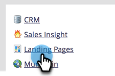
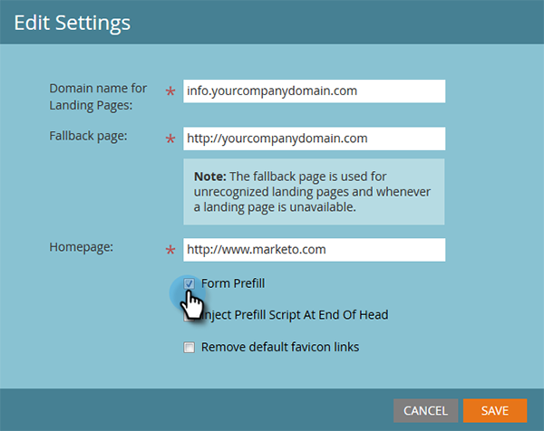
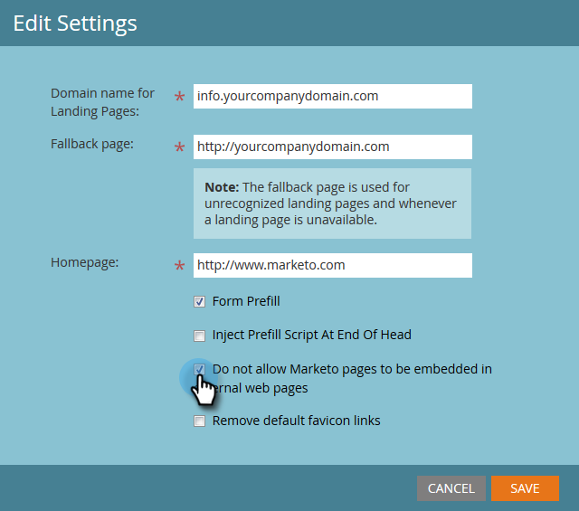

# Editar configuración de página de destino {#edit-landing-page-settings}

Puede editar su nombre de dominio y página de reserva, habilitar o deshabilitar el rellenado previo del formulario, evitar el uso indebido de su página de aterrizaje y mucho más. Siga los pasos a continuación.

>[!NOTE]
>
>**Se requieren permisos de administrador**

1. Vaya al área de **[!UICONTROL Admin]**.

   

1. Haga clic en **[!UICONTROL Páginas de aterrizaje]**.

   

1. En la sección **[!UICONTROL Páginas de destino]**, haga clic en **[!UICONTROL Editar]**.

   

1. Introduzca su dominio y la información de la página.

   

   | Término | Definición |
   |---|---|
   | [!UICONTROL Nombre de dominio para páginas de aterrizaje] | Este es su CNAME. Un CNAME es la primera parte de la dirección URL que proporciona a las personas para páginas de aterrizaje. Por ejemplo, en `https://go.yourCompany.com`, la palabra &quot;ir&quot; es el CNAME. Puede tener varios, pero la mayoría de las personas solo utilizan uno. |
   | [!UICONTROL Página de reserva] | Aquí es donde debe ir si la página de aterrizaje no existe o está caída. Más información sobre [páginas de reserva](/help/marketo/product-docs/administration/settings/set-a-fallback-page.md). |
   | [!UICONTROL Página principal] | Introduzca la URL de su sitio corporativo. |

1. Marque la casilla de verificación **[!UICONTROL Relleno previo de formulario]** para permitir que los formularios prerrellenen información de personas conocidas (cookies). Desmarque para bloquear.

   

   >[!NOTE]
   >
   >Si desea que la etiqueta de relleno previo `<script>` aparezca al final de la etiqueta `<head>` en el código, marque la casilla **[!UICONTROL Insertar script de relleno previo al final del encabezado]**. Deje sin marcar si desea que aparezca al principio.
   >
   >Marque **[!UICONTROL Quitar vínculos de favicon predeterminados]** para evitar que Marketo inserte vínculos de favicon en el código.

1. Después de hacer las selecciones, haz clic en **[!UICONTROL Guardar]**.

   

   Las páginas de aterrizaje ahora tienen la información correcta y deben comenzar a funcionar inmediatamente.
