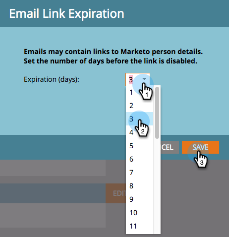

# Editar la caducidad de los vínculos en Informes y alertas {#edit-link-expiration-in-reports-and-alerts}

Los vínculos de los correos electrónicos de suscripción al informe caducan al cabo de tres días. Para cambiar la hora de caducidad de estos vínculos, siga estos pasos.

>[!NOTE]
>
>**Se requieren permisos de administrador**

1. Vaya a la sección **[!UICONTROL Admin]**.

   

1. Haga clic en **[!UICONTROL Configuración de inicio de sesión]**.

   

1. Haga clic en **[!UICONTROL Editar caducidad de URL]**.

   

1. En la lista desplegable, seleccione el número de días antes de que caduque el vínculo. Haga clic en **[!UICONTROL Guardar]**.

   

>[!IMPORTANT]
>
>Esta configuración solo se aplica a los vínculos de informes y alertas. No se aplica **not** al vínculo enviado por correo electrónico [informe de descarga](/help/marketo/product-docs/reporting/basic-reporting/report-subscriptions/subscribe-to-a-smart-list.md#email-message) o a los correos electrónicos de marketing.
