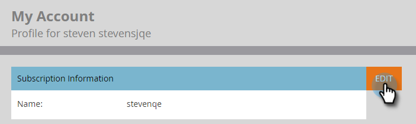

# Editar configuración de suscripción {#edit-subscription-settings}

Si tiene acceso a varias suscripciones a Marketo y desea asegurarse de cuál está utilizando, intente asignarles un nombre único. A continuación, ese nombre se muestra en la parte superior de la página de suscripción.

Por ejemplo, si trabaja en las instancias de producción y simulación de pruebas, puede asignar un nombre a una suscripción **Producción de Marketo** y el otro **Simulador para pruebas de Marketo**.

1. Vaya a **Admin**.

   

1. Haga clic en **Mi cuenta**.

   

1. Haga clic en **Editar información de suscripción**.

   

1. Realice las ediciones y haga clic en **Guardar**.

   

   ¡Ta-da! Su suscripción tiene un nombre nuevo.
