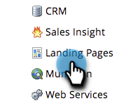

# Habilite direcciones URL personalizadas para su cuenta {#enable-personalized-urls-for-your-account}

Las direcciones URL personalizadas son ideales para campañas de correo impreso.

>[!NOTE]
>
>**Se requieren permisos de administración**

1. Vaya al área de **[!UICONTROL Admin]**.

   

1. Haga clic en **[!UICONTROL Páginas de aterrizaje]**.

   

1. Haga clic en **[!UICONTROL Editar]**.

   

1. Marque la casilla **[!UICONTROL Habilitar direcciones URL personalizadas]** y haga clic en **[!UICONTROL Guardar]**.

   

¡Buen trabajo! Ahora que ha habilitado las PURL en su cuenta, puede [habilitarlas para páginas de aterrizaje individuales](/help/marketo/product-docs/demand-generation/landing-pages/personalizing-landing-pages/enable-personalized-urls-for-a-landing-page.md).

>[!NOTE]
>
>Si hay dos personas con el mismo nombre/apellido, el sistema anexará automáticamente un número al final.
