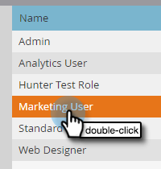

# Reglas globales de validación de formularios {#global-form-validation-rules}

Esta función permite bloquear dominios específicos para que no se envíen a formularios de Marketo Engage.

## Cómo habilitar el acceso {#how-to-enable-access}

Para poder utilizar esta función, debe habilitar su permiso según la función que desee.

1. En Marketo, haga clic en **Administrador**.

   

1. Haga clic en **Usuarios y funciones**.

   

1. Haga clic en el **Funciones** pestaña .

   

1. Haga doble clic en la función a la que desee conceder permisos.

   

1. Haga clic en el **+** junto a Administración de acceso.

   

1. Desplácese hacia abajo y seleccione **Acceso a las reglas de validación del formulario** y haga clic en **Guardar**.

   

## Crear nueva regla de validación de formulario {#create-new-form-validation-rule}

>[!IMPORTANT]
>
>Estas reglas se aplicarán a todos los formularios de las suscripciones al Marketo Engage.

1. En Marketo, haga clic en **Administrador**.

   

1. Haga clic en **Regla de validación del formulario global**.

   

1. Haga clic en **Nueva regla de validación de formulario**.

   

   >[!NOTE]
   >
   >La lista desplegable Acciones de regla de validación de formulario permite eliminar o editar las reglas existentes.

1. Asigne un nombre a la regla, asígnele una descripción opcional e introduzca el mensaje de error que desea que vean los visitantes del formulario. Introduzca los dominios que desea bloquear en el cuadro de reglas, seleccione **Activar regla** y haga clic en **Crear**.

   

>[!NOTE]
>
>Marketo Engage tiene una lista de bloqueados definida de dominios de correo electrónico de consumidor gratuitos que se bloquean al utilizar nuestra regla de &quot;Lista de bloqueados de dominio de correo electrónico de consumidor&quot; precargada. [Ver la lista aquí](/help/marketo/product-docs/administration/settings/assets/freemaildomains.csv).

## Deshabilitar el acceso por formulario{#how-to-disable-access-per-form}

Una vez activada, las reglas se aplican a todos los formularios. Sin embargo, si tiene un formulario con requisitos específicos y no desea que se rechace nada, puede desactivar las reglas de validación del formulario global en la configuración de un formulario.

1. En el formulario que desee, haga clic en **Configuración de formulario**, luego **Configuración**.

   

1. Haga clic en la lista desplegable Reglas de validación de formulario globales y seleccione **Desactivado**.

   

Cuando apruebe y publique el formulario, ignorará las reglas de validación del formulario global.
