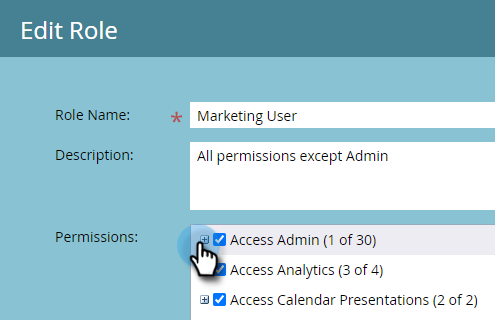
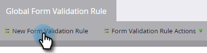
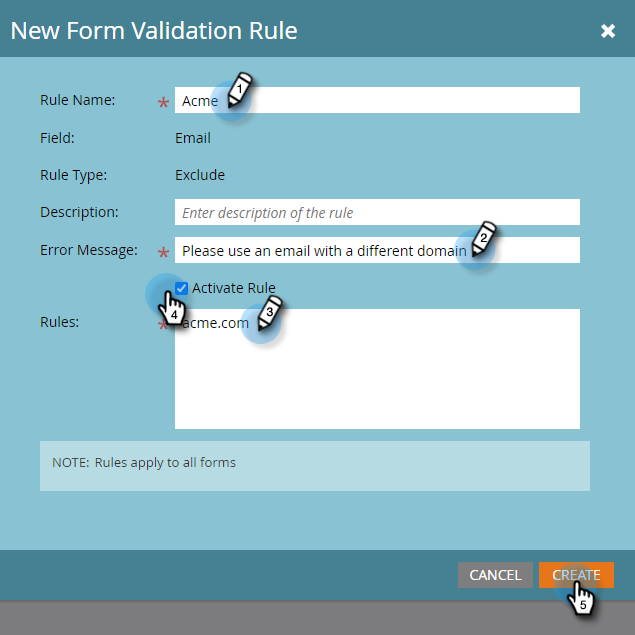

# Reglas de formulario de validación global {#global-form-validation-rules}

Esta función le permite bloquear dominios específicos para que no se envíen a formularios Marketo Engage.

## Cómo activar el acceso {#how-to-enable-access}

Para poder utilizar esta función, debe habilitar su permiso para cada función deseada.

1. En Marketo, haga clic en **[!UICONTROL Administrador]**.

   

1. Haga clic en **[!UICONTROL Usuarios y funciones]**.

   

1. Haga clic en la ficha **[!UICONTROL Roles]**.

   

1. Haga doble clic en la función a la que desee conceder permisos.

   

1. Haga clic en el signo **+** junto a **Administrador de acceso**.

   

1. Desplácese hacia abajo y seleccione **[!UICONTROL Reglas de validación de formularios de acceso]** y haga clic en **[!UICONTROL Guardar]**.

   

## Crear nueva regla de validación de formulario {#create-new-form-validation-rule}

>[!IMPORTANT]
>
>Estas reglas se aplicarán a todos los formularios de las suscripciones de Marketo Engage.

1. En Marketo, haga clic en **[!UICONTROL Administrador]**.

   

1. Haga clic en **[!UICONTROL Regla de validación de formulario global]**.

   

1. Haga clic en **[!UICONTROL Nueva regla de validación de formulario]**.

   

   >[!NOTE]
   >
   >La lista desplegable [!UICONTROL Acciones de regla de validación de formulario] le permite eliminar o editar las reglas existentes.

1. Asigne un nombre a la regla, asígnele una descripción opcional e introduzca el mensaje de error que desea que vean los visitantes del formulario. Escriba uno o varios dominios que desee bloquear en el cuadro de reglas, seleccione **[!UICONTROL Activar regla]** y haga clic en **[!UICONTROL Crear]**.

   

>[!NOTE]
>
>Marketo Engage tiene una lista de bloqueados definida de dominios de correo electrónico de consumidor libre que se bloquean al utilizar la regla precargada &quot;Lista de bloqueados de dominio de correo electrónico de consumidor&quot;. [Ver esa lista aquí](/help/marketo/product-docs/administration/settings/assets/freemaildomains.csv) (para descargarla, asegúrate de que tu navegador esté actualizado y de que acepte descargas).

## Cómo deshabilitar el acceso por formulario{#how-to-disable-access-per-form}

Una vez activadas, las reglas se aplican a todos los formularios. Sin embargo, si tiene un formulario con requisitos específicos y no desea que se rechace nada, puede deshabilitar [!UICONTROL Reglas globales de validación de formularios] en la configuración del formulario.

1. En el formulario que desee, haga clic en **[!UICONTROL Configuración del formulario]** y luego en **[!UICONTROL Configuración]**.

   

1. Haga clic en el menú desplegable **[!UICONTROL Reglas de validación de formulario global]** y elija **[!UICONTROL Deshabilitado]**.

   

Cuando apruebe y publique el formulario, se omitirán las [!UICONTROL reglas globales de validación de formularios].
