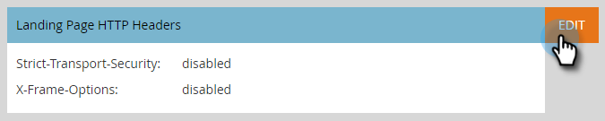

# Landing Page Headers {#landing-page-headers}

Siga los pasos a continuación para personalizar algunos de los encabezados HTTP de los dominios de la página de aterrizaje.

1. En Marketo, haga clic en **Administrador**.

   

1. Haga clic en **Páginas de aterrizaje**.

   

1. Haga clic en **Editar** junto a Encabezados HTTP de la página de aterrizaje.

   

1. Elija la configuración que desee y haga clic en **Guardar** cuando haya terminado.

   

<table>
 <tr>
  <td><strong>Strict-Transport-Security</strong></td>
  <td>Utilice esto para garantizar que las conexiones a las páginas de aterrizaje siempre se proporcionen a través de HTTPS (solo debe establecerse para suscripciones con páginas de aterrizaje seguras mediante SSL)</td>
 </tr>
 <tr>
  <td><strong>X-Frame-Options</strong></td>
  <td>Lets you define whether or not Marketo Engage hosted assets can be embedded in external web pages</td>
 </tr>
</table>

>[!CAUTION]
>
>Es importante revisar esta configuración con su equipo de TI para determinar en qué debe configurarse la política de su organización. Incorrect settings can prevent some visitors from accessing your Landing Pages.
