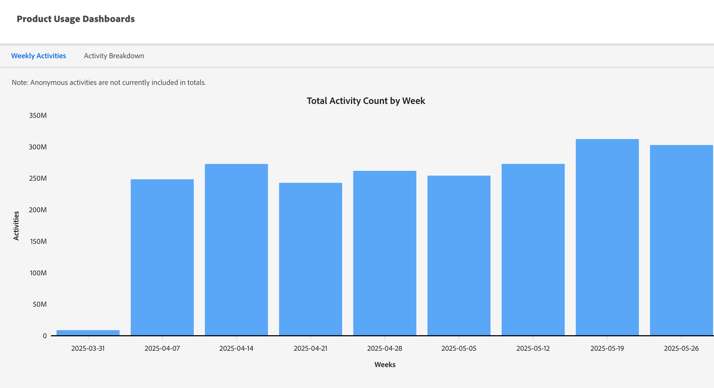

# Paneles de uso del producto {#product-usage-dashboards}

Los paneles de uso de productos de Marketo Engage permiten ver el uso de los productos y las plataformas en relación con ciertos límites o registros pendientes del rendimiento de los datos, el uso con respecto a la cuota diaria y las métricas clave de una suscripción. La infraestructura se asigna para proporcionar límites de rendimiento definidos para los niveles de producto para atributos específicos. Algunos de estos límites, como el uso de API, son límites contratados adquiridos como parte de su paquete o nivel de producto.

## Cómo acceder a {#how-to-access}

1. En Marketo Engage, haga clic en **Administrador**.

   

1. En el árbol de la izquierda, desplácese hacia abajo y seleccione **Paneles de uso del producto**.

   

## Tablero de uso de actividades {#activity-usage-dashboard}

### Actividades semanales medias {#average-weekly-activities}

El panel Uso de actividades semanal proporciona un recuento semanal de tipos de actividades durante un periodo móvil de 52 semanas. Las actividades semanales que se producen son un buen indicador de la cantidad de marketing que se realiza en Marketo Engage. Las actividades sirven como proxy para los distintos procesos del sistema y eventos a los que se puede realizar un seguimiento dentro de Marketo.

Los tipos de actividad incluyen recuentos de actividades capturadas cuando las personas interactúan con eventos de marketing, así como actividades basadas en el sistema y activadas por Acciones de flujo. Algunos ejemplos de actividades iniciadas por una persona son cuando una persona abre un correo electrónico o hace clic en un vínculo de un correo electrónico. Un ejemplo de actividades basadas en el sistema y activadas por una acción de flujo es &quot;Enviar a SFDC&quot; cuando se inicia el déclencheur. Para ver el recuento de tipos de actividades de una semana en particular, coloque el puntero del ratón sobre una semana y visualice el recuento.

{width="800" zoomable="yes"}

#### Preguntas frecuentes {#faq}

**¿Qué tipos de actividades se cuentan?**

Depende de las actividades que se incluyan en la canalización.

**¿Se incluye la actividad de posible cliente/persona conocida y anónima?**

Solo personas conocidas/posibles clientes.

**¿Con qué frecuencia se actualizan los datos?**

Los recuentos de actividades se actualizan cada mañana.

## Desglose de actividades {#activity-breakdown}

Aquí se obtienen recuentos de actividades durante los siete días anteriores basados en segmentos significativos de los datos. Agrupe actividades por los tipos de actividades más comunes vistos en los últimos siete días. Esto puede incluir categorías como &quot;Cambiar valor de datos&quot;, &quot;Agregar a la lista&quot; o &quot;Enviar correo electrónico&quot;. Esto le permite ver qué tipos de actividades se producen con más frecuencia en el sistema. El uso del tipo de actividad es un indicador clave para determinar el crecimiento o si se necesitan optimizaciones para reducir el uso.

>[!NOTE]
>
>* Todos los desgloses siguientes son una suma &quot;móvil de siete días&quot; y **no** incluyen el día actual. Piensen en ello como &quot;ayer + seis días antes de eso&quot;.
>
>* El panel solo muestra los 20 tipos de actividades principales, mientras que el resto se ordenan en una categoría titulada &quot;Otro&quot;.

{width="800" zoomable="yes"}

El uso de la actividad es un indicador clave de cuánto se está realizando marketing y ayuda a visualizar el crecimiento en comparación con el nivel de producto contratado para. Los paneles también se pueden utilizar como guía para determinar cuánta optimización se puede/debe realizar reduciendo los campos que se actualizan.

### Por tipo {#by-type}

Agrupe actividades por los tipos de actividades más comunes vistos en los últimos siete días. Esto puede incluir categorías como _Cambiar valor de datos_, _Agregar a lista_ o _Enviar correo electrónico_. Esto le permite ver qué tipos de actividades se producen con más frecuencia en Marketo Engage.

### Por atributo de valor de datos de cambio {#by-change-data-value-attribute}

_Cambiar valor de datos_ es el tipo de actividad más común. Indica cuándo se actualiza un fragmento de información de un registro de persona/posible cliente. Aquí, agrupamos por los campos que se cambian con mayor frecuencia para que pueda determinar si qué información es útil para sus operaciones de marketing, si hay oportunidades para optimizar el uso de la plataforma, etc.

### Por campaña {#by-campaign}

Grupo por el que las campañas producen la mayoría de las actividades. Esto ofrece a insight para ver si hay campañas particularmente &quot;ruidosas&quot; que creen más actividad de la necesaria. Obtenga información rápidamente sobre las campañas que deben retirarse del mercado o sobre las campañas que están haciendo más trabajo del previsto.

### Por Source (PRÓXIMAMENTE) {#by-source}

Agrupar por el origen de las actividades (_Sincronización de CRM_, _Acción de flujo de campaña_, _Carga de API_, _Relleno del formulario de la página de aterrizaje_, etc.). Esto le ayuda a comprender si la mayoría de las actividades las producen acciones de marketing, sincronizaciones de CRM o las propias personas/posibles clientes.
