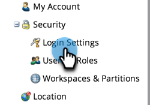

# Restringir inicios de sesión de Marketo según la dirección IP {#restrict-marketo-logins-based-on-ip}

Puede restringir o permitir que los usuarios accedan a Marketo en función de sus direcciones IP. Así es como.

>[!NOTE]
>
>**Permisos de administración necesarios**

>[!IMPORTANT]
>
>La información de este artículo es para usuarios que inician sesión directamente en login.marketo.com y no se aplica a aquellos que se autentican con Adobe ID. No es posible aplicar restricciones de IP en los inicios de sesión únicos (SSO) en este momento.

1. Vaya a la **[!UICONTROL Administrador]** área.

   

1. Clic **[!UICONTROL Configuración de inicio]**.

   

1. Clic **[!UICONTROL Editar restricciones de IP]**.

   

1. Elija si desea **Permitir** o **Bloquear** direcciones específicas, introduzca las direcciones y haga clic en **[!UICONTROL Guardar]**.

   >[!NOTE]
   >
   >**Definición**
   >
   >* **[!UICONTROL Direcciones IP permitidas]**: Añadir direcciones IP permitidas es inclusivo. Incluirá todas las direcciones IP especificadas y excluirá todo lo demás.
   >* **[!UICONTROL Bloquear direcciones IP]**: Evita que direcciones IP específicas accedan a Marketo.
   >* **[!UICONTROL Deshabilitar restricciones de IP]**: si selecciona esta opción, dejarán de funcionar todas las reglas de restricción. Utilícelo para realizar pruebas.

   >[!NOTE]
   >
   >Puede añadir varias restricciones, pero solo se pueden permitir TODAS o bloquear TODAS. No puede combinar los elementos permitidos y bloqueados.

   

   Bien hecho, sus datos de marketing ahora son más seguros que nunca.
