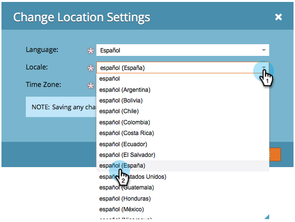

# Seleccione su idioma, configuración regional y zona horaria {#select-your-language-locale-and-time-zone}

¿El inglés no es tu primer idioma? No te preocupes, te tenemos cubierto. Aquí se explica cómo cambiar su propio idioma, configuración regional y zona horaria.

## Idiomas admitidos {#supported-languages}

* Inglés
* Francés
* Alemán
* Japonés
* Portugués
* Español

## Cambiar idioma de usuario, configuración regional y zona horaria {#change-user-language-locale-and-time-zone}

1. Inicie sesión en Marketo y, bajo su nombre, seleccione **Mi cuenta**.

   

1. En Mi cuenta, haga clic en **Editar configuración de ubicación**.

   

1. Cambie su **Idioma**.

   

   >[!TIP]
   >
   >También tiene la opción de cambiar solo su idioma haciendo clic en el menú desplegable de idioma en la parte superior de la página de inicio de sesión.

1. Cambie la **configuración regional**.

   

1. Cambie su **Zona horaria**.

   

1. Haga clic en **Guardar**.

   

¡Buen trabajo! El explorador se actualizará y debería ver los cambios reflejados.

