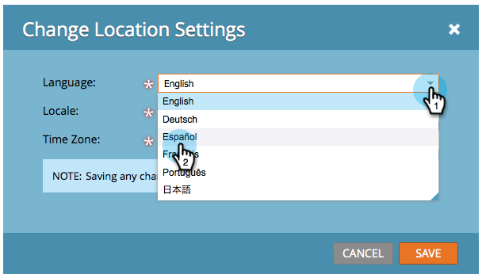

# Seleccione su idioma, configuración regional y zona horaria {#select-your-language-locale-and-time-zone}

¿El inglés no es tu primera lengua? No te preocupes, te tenemos cubierto. A continuación se indica cómo cambiar el idioma, la configuración regional y el huso horario de la instancia de Marketo Engage.

>[!IMPORTANT]
>
>Este artículo es solo para aquellos que _no_ usan [Marketo con identidad de Adobe](/help/marketo/product-docs/administration/marketo-with-adobe-identity/adobe-identity-management-overview.md){target="_blank"}. Si lo hace, se puede acceder a la configuración que se describe a continuación en su [perfil de cuenta de Adobe](https://account.adobe.com/profile){target="_blank"}.

## Idiomas admitidos {#supported-languages}

* Inglés
* Francés
* Alemán
* Japonés
* Portugués
* Español

## Cambiar idioma, configuración regional y zona horaria del usuario {#change-user-language-locale-and-time-zone}

1. Vaya al área de **[!UICONTROL Admin]**.

   

1. Seleccione **[!UICONTROL Mi cuenta]**.

   

1. En Mi cuenta, haga clic en **[!UICONTROL Editar configuración de ubicación]**.

   

1. Cambia tu **[!UICONTROL idioma]**.

   

   >[!TIP]
   >
   >También tiene la opción de cambiar solo el idioma haciendo clic en la lista desplegable de idioma en la parte superior de la página de inicio de sesión.

1. Cambia tu **[!UICONTROL configuración regional]**.

   

1. Cambia tu **[!UICONTROL Zona Horaria]**.

   

1. Haga clic en **[!UICONTROL Guardar]**.

   

¡Buen trabajo! El explorador se actualizará y debería ver los cambios reflejados.

