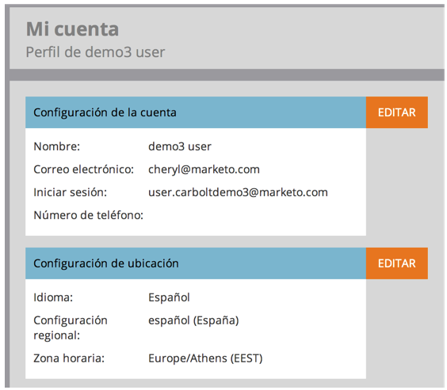

# Seleccione su idioma, configuración regional y zona horaria {#select-your-language-locale-and-time-zone}

¿El inglés no es tu primer idioma? No te preocupes, te tenemos cubierto. Aquí se explica cómo cambiar su propio idioma, configuración regional y zona horaria.

## Idiomas admitidos {#supported-languages}

* Inglés
* Francés
* Alemán
* Japonés
* Portugués
* Español

## Cambiar idioma de usuario, configuración regional y zona horaria {#change-user-language-locale-and-time-zone}

1. Vaya a la **Administrador** .

   

1. Select **Mi cuenta**.

   

1. En Mi cuenta, haga clic en **Editar configuración de ubicación**.

   

1. Cambie el **Idioma**.

   

   >[!TIP]
   >
   >También tiene la opción de cambiar solo su idioma haciendo clic en el menú desplegable de idioma en la parte superior de la página de inicio de sesión.

1. Cambie el **Configuración regional**.

   

1. Cambie el **Zona horaria**.

   

1. Haga clic en **Guardar**.

   

¡Buen trabajo! El explorador se actualizará y debería ver los cambios reflejados.

