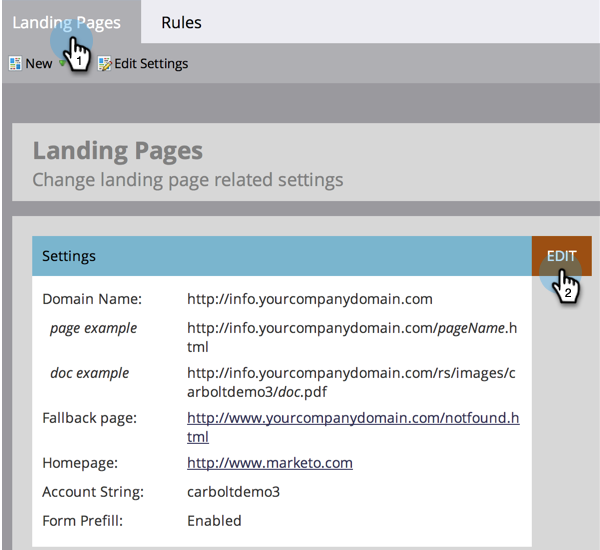

# Establecer una página de reserva {#set-a-fallback-page}

Las páginas de reserva son la última línea de defensa si la página de aterrizaje está sin conexión o no se encuentra. Asegúrese de que tiene uno.

>[!NOTE]
>
>**Permisos de administración necesarios**

1. Vaya a la **[!UICONTROL Administrador]** área.

   

1. Clic **[!UICONTROL Páginas de aterrizaje]**.

   

1. En el **[!UICONTROL Páginas de aterrizaje]** pestaña, haga clic en **[!UICONTROL Editar]**.

   

1. Introduzca una **[!UICONTROL Página de reserva]** en el cuadro de diálogo y pulse en **[!UICONTROL Guardar]**.

   

