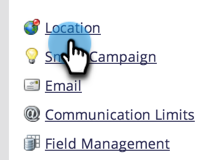
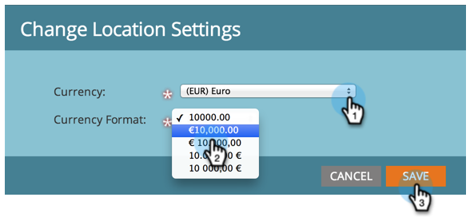

# Establecer la moneda predeterminada {#set-default-currency}

Obtenga información sobre cómo ver y editar la divisa predeterminada de su suscripción a Marketo Engage.

>[!NOTE]
>
>Se requieren **permisos de administración.**

1. Vaya al área de **[!UICONTROL Admin]**.

   

1. Haga clic en **[!UICONTROL Ubicación]**.

   

1. Haga clic en **[!UICONTROL Editar]** en [!UICONTROL Configuración de moneda de suscripción].

   

1. Seleccione el formato de moneda que desee y haga clic en **[!UICONTROL Guardar]**.

   
