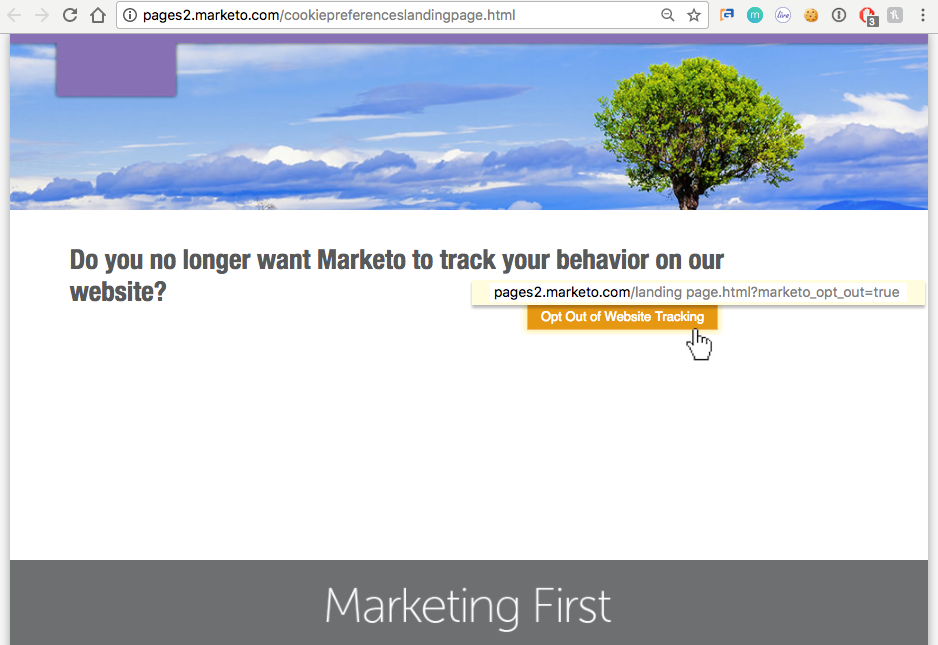

# Explicación de la configuración de privacidad {#understanding-privacy-settings}

## Información general {#overview}

Marketo ofrece a los especialistas en marketing una forma de obtener el consentimiento de los visitantes web para realizar un seguimiento de ellos. Existen dos formas de exclusión o puede elegir que se le rastree mediante una IP anónima.

* Los visitantes web seleccionan la función No rastrear (DNT) en su explorador (y el experto en marketing acepta la solicitud del visitante web de No rastrear)
* Los visitantes web utilizan una cookie de exclusión proporcionada por un experto en marketing de un sitio web

O bien, el experto en marketing puede rastrear usuarios, pero utilizar una IP anónima.

Estos métodos pueden afectar al valor y la funcionalidad de Marketo en áreas específicas. Sin embargo, si el experto en marketing _no lo tiene_ Para cambiar cualquier cosa en la configuración de Marketo, la funcionalidad de Marketo sigue siendo la misma.

## Configuración del explorador para No rastrear {#browser-settings-for-do-not-track}

Los visitantes web pueden configurar su navegador para evitar el seguimiento de cualquier sitio web eligiendo &quot;No rastrear&quot; (DNT). Esto evita el seguimiento de este explorador y dispositivo en particular. Consulte la configuración de privacidad del explorador para obtener información detallada.

Entrada [!DNL Munchkin], un experto en marketing puede [decida si admite o ignora la configuración DNT del explorador](/help/marketo/product-docs/administration/settings/edit-do-not-track-browser-support-settings.md).

En la personalización web, un experto en marketing puede decidir si [admitir o ignorar la configuración DNT del explorador](/help/marketo/product-docs/web-personalization/getting-started/setting-web-personalization-to-do-not-track.md).

## Exclusión de un sitio web específico {#opt-out-from-a-specific-website}

También puede permitir que los visitantes del sitio excluyan el seguimiento del sitio web, independientemente de si lo hacen o no **No rastrear el explorador** Los ajustes de están configurados. Esto permite al visitante del sitio especificar sus preferencias de seguimiento directamente desde el sitio web.

Para ello, debe añadir un parámetro a un vínculo de no participación en una página web que tenga [!DNL Munchkin] seguimiento activado. Puede ser cualquier página web, pero el vínculo a la página web debe contener el parámetro siguiente:

?marketo_opt_out=true

A continuación se muestran ejemplos de una página web con un vínculo de no participación y una página de aterrizaje para después de hacer clic en el vínculo. El suyo variará.

Esta es una página web con un botón con el parámetro &quot;?marketo_opt_out=true&quot; en el vínculo de no participación.

Puede crear y publicar una página de aterrizaje como página de seguimiento para cuando se haga clic en el vínculo con el parámetro &quot;?marketo_opt_out=true&quot;.

Cuando se hace clic en el vínculo, Marketo agrega una cookie llamada **mkto_opt_out** al explorador del visitante que deshabilita [!DNL Munchkin] seguimiento del visitante del sitio que hace clic en el vínculo con el parámetro anterior.

Para validar que la cookie se puede plantar, compruebe que es un posible cliente con cookies y haga clic en el vínculo. A continuación, compruebe las cookies del explorador para comprobar que la variable **mkto_opt_out** se ha añadido la cookie.

>[!NOTE]
>
>Actualmente solo funciona con [!DNL Munchkin] versiones 152 y posteriores.

## Opt-in {#opt-in}

Los especialistas en marketing pueden permitir que los usuarios acepten la inclusión mediante las funciones de Marketo en correos electrónicos, formularios, páginas de aterrizaje y otros métodos.

## Seguimiento con una IP anónima {#tracking-using-an-anonymized-ip}

Los especialistas en marketing pueden preservar la privacidad realizando un seguimiento de los usuarios con una dirección IP anónima. Para ello, añada este código al RTP o [!DNL Munchkin] Javascript que está incrustado en el sitio web.

* Para [!DNL Munchkin], simplemente agregue {&quot;anonymizeIP&quot;,true} a la función init.

  >[!NOTE]
  >
  >El uso de este parámetro requiere lo siguiente [!DNL Munchkin] V2 estar habilitado. Para activarlo para su suscripción, póngase en contacto con [Asistencia de Marketo](https://nation.marketo.com/community/support_solutions).

* Para la personalización web (RTP), añada esto al javascript:

`anonymize IP : before calling rtp('send','view'); add rtp('set', 'settings', {'anonymizeIP' : true});`
