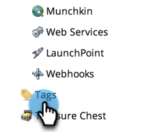
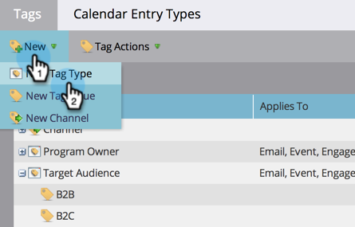
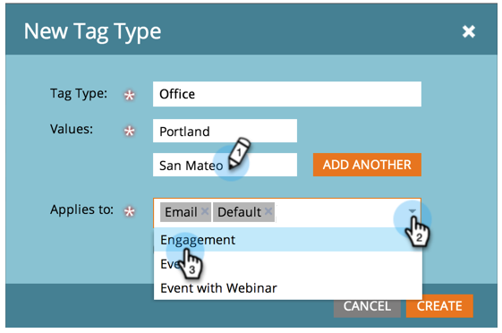
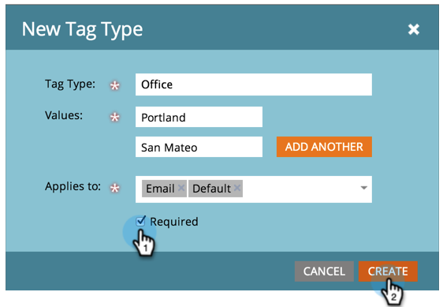
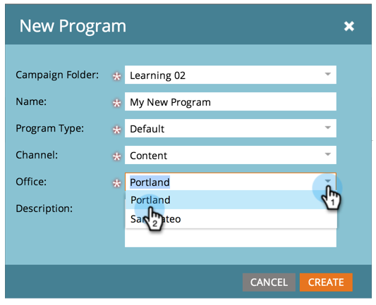

# Creación de una nueva etiqueta de programa y valores de etiqueta {#create-a-new-program-tag-and-tag-values}

>[!NOTE]
>
>**Se requieren permisos de administrador**

Puede crear [etiquetas](/help/marketo/product-docs/core-marketo-concepts/programs/working-with-programs/understanding-tags.md) personalizadas para sus programas y asignar valores a la etiqueta.

>[!NOTE]
>
>**Ejemplo**
>
>Etiqueta de programa: Audiencia de destino
>
>Valor de etiqueta de programa: SMB, empresa, mercado medio

1. Vaya al área de **[!UICONTROL Admin]**.

   

1. Haga clic en **[!UICONTROL Etiquetas]**.

   

1. Haga clic en **[!UICONTROL Nuevo]** y seleccione **[!UICONTROL Nuevo tipo de etiqueta]**.

   

1. Escriba **[!UICONTROL Tag Type]** y una etiqueta **[!UICONTROL Value]**. Luego haga clic en **[!UICONTROL Agregar otro]**.

   

1. Introduzca tantos valores como necesite. Seleccione a qué tipos de programas desea aplicar esta etiqueta.

   

   >[!TIP]
   >
   >Puede seleccionar varios tipos de programas. Cuando se crea un nuevo programa, este tipo de etiqueta está disponible.

1. Marque **[!UICONTROL Obligatorio]** y haga clic en **[!UICONTROL Crear]**.

   

   >[!NOTE]
   >
   >Si el tipo de etiqueta es **[!UICONTROL Obligatorio]**, los usuarios deberán especificar un valor para la etiqueta al crear un nuevo programa.

   

Cuando los usuarios creen un programa, tendrán que establecer el valor personalizado para la etiqueta creada.
