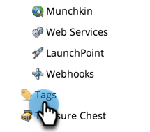

# Crear una etiqueta de programa nueva y valores de etiqueta {#create-a-new-program-tag-and-tag-values}

>[!NOTE]
>
>**Se requieren permisos de administrador**

Puede crear [etiquetas](/help/marketo/product-docs/core-marketo-concepts/programs/working-with-programs/understanding-tags.md) para sus programas y asigne valores a la etiqueta .

>[!NOTE]
>
>**Ejemplo**
>
>Etiqueta del programa: Audiencia de Target
>
>Valor de la etiqueta del programa: SMB, empresa, mercado medio

1. Vaya a la **Administrador** .

   

1. Haga clic en **Etiquetas**.

   

1. Haga clic en **Nuevo** y seleccione **Nuevo tipo de etiqueta**.

   

1. Introduzca la variable **Tipo de etiqueta** y una etiqueta **Valor**. A continuación, haga clic en **Añadir otro**.

   

1. Introduzca tantos valores como necesite. Seleccione a qué tipos de programa desea aplicar esta etiqueta.

   

   >[!TIP]
   >
   >Puede seleccionar varios tipos de programa. Cuando se crea un nuevo programa, este tipo de etiqueta estará disponible.

1. Marque **Requerido** y haga clic en **Crear**.

   

   >[!NOTE]
   >
   >Si el tipo de etiqueta es **Requerido**, los usuarios deberán introducir un valor para la etiqueta al crear un nuevo programa.

   

Ahora, cuando los usuarios creen un programa, tendrán que establecer el valor personalizado para la etiqueta creada.
