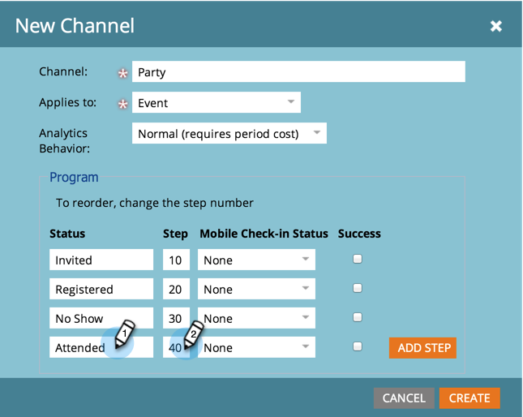

# Crear un canal de programa {#create-a-program-channel}

Un programa es una iniciativa de marketing específica. El canal está diseñado para ser el mecanismo de entrega, como seminario web, patrocinio o anuncio en línea.

>[!NOTE]
>
>**Permisos de administración necesarios**

>[!NOTE]
>
>Más información sobre [programas](/help/marketo/product-docs/core-marketo-concepts/programs/creating-programs/understanding-programs.md), el elemento más importante de Marketo.

1. Vaya a la **[!UICONTROL Administrador]** área.

   

1. Clic **[!UICONTROL Etiquetas]**.

   

   >[!NOTE]
   >
   >¿Por qué etiquetas? Un canal es una forma de describir un programa, al igual que otras etiquetas. El canal solo tiene características adicionales especiales.

1. Haga clic en **+** firmar junto a [!UICONTROL Canal] para expandir y ver los canales existentes.

   

1. En **[!UICONTROL Nuevo]**, haga clic en **[!UICONTROL Nuevo canal]**.

   

   >[!NOTE]
   >
   >**Ejemplo**
   >
   >Canal: vallas publicitarias
   >
   >* Aplicar a: Predeterminado
   >* Progresión: Miembro, Comprometido (si tiene dudas, funcionan bien)
   >* Éxito: participación
   >
   >Canal: Party
   >
   >* Aplicar a: evento
   >* Progresión: Invitado, Registrado, Sin show y Asistido
   >* Éxito: asistencia
   >
   >Consulte las Progresiones de canales existentes para hacerse una idea de cómo utilizarlos.

1. Vamos con el ejemplo del canal Party. Asigne un nombre al nuevo **Canal** y seleccione el tipo de programa al que se aplicará.

   

   >[!NOTE]
   >
   >¿Aplicar a qué? Existen varios tipos de programas. Haga coincidir el canal con el tipo derecho. En caso de duda, elija **[!UICONTROL Predeterminado]**.

   >[!NOTE]
   >
   >Al usar &quot;[!UICONTROL Evento con seminario web],&quot; las asignaciones del sistema se bloquearán (según lo requieran las integraciones del seminario web) y no se podrán editar.

1. Introduzca los dos primeros nombres de estado del programa y haga clic en **[!UICONTROL Añadir etapa]**.

   

1. Introduzca otro programa **[!UICONTROL Estado]** y **[!UICONTROL Etapa]** número y haga clic en **[!UICONTROL Añadir etapa]**.

   

   >[!TIP]
   >
   >El **[!UICONTROL Etapa]** El número se utiliza para ordenar los estados del programa. Tenga en cuenta que las personas no pueden retroceder en estos pasos de progresión. Solo pueden cambiar el estado a un estado de valor mayor o igual. Utilice los valores iguales cuando los estados estén pensados para cambiar de un lado a otro en lugar de una progresión.

1. Introduzca el último programa **[!UICONTROL Estado]** y **[!UICONTROL Etapa]** número.

   

   >[!NOTE]
   >
   >Al usar el tipo &quot;[!UICONTROL Evento],&quot; se requiere la asignación del sistema para los estados Registrado, En lista de espera y Asistido. Como tal, esos estados no se pueden ocultar.

1. Elija el **[!UICONTROL Estado de facturación móvil]** para **[!UICONTROL Registrados]**.

   

1. Elija el **[!UICONTROL Estado de facturación móvil]** para **[!UICONTROL Asistió]**.

   

   >[!NOTE]
   >
   >**[!UICONTROL Estado de facturación móvil]** Las opciones de solo estarán disponibles si el canal es para programas de eventos.

   >[!NOTE]
   >
   >Solo las personas con **[!UICONTROL Estado de facturación móvil]** de **[!UICONTROL Registrados]** y **[!UICONTROL Asistió]** será visible en el [Aplicaciones de registro móviles](/help/marketo/product-docs/core-marketo-concepts/mobile-apps/event-check-in/event-check-in-overview.md).

   >[!TIP]
   >
   >Si se crea una nueva persona en la aplicación de registro móvil, se establece en Registrada en el programa de evento. Si una persona se registra en el evento de la aplicación, se establecerá en Asistió en el programa de evento.

1. Seleccione el **[!UICONTROL Correcto]** estado del programa y haga clic en **[!UICONTROL Crear]**.

   

   ¡Bien hecho! Cuando realice un nuevo programa de ese tipo, este nuevo canal será una de las opciones.
