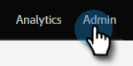

# Crear etiquetas personalizadas {#create-custom-tags}

Las etiquetas le ayudarán a organizar sus programas, mientras que los canales le ayudarán a recopilar datos para realizar informes.

>[!NOTE]
>
>Desproteger [Explicación de las etiquetas](/help/marketo/product-docs/core-marketo-concepts/programs/working-with-programs/understanding-tags.md) para obtener más información.

>[!NOTE]
>
>**Permisos de administración necesarios**

## Crear nuevo tipo de etiqueta {#create-a-new-tag-type}

Para crear un nuevo tipo de etiqueta:

1. Vaya a la **[!UICONTROL Administrador]** sección.

   

1. Clic **[!UICONTROL Etiquetas]**.

   

1. Clic **[!UICONTROL Nuevo]** y seleccione **[!UICONTROL Nuevo tipo de etiqueta]**.

   

1. Introduzca un nombre para el Tipo de etiqueta.

   

1. Introduzca el valor deseado para el tipo de etiqueta. Clic **[!UICONTROL Añadir otro]** para introducir valores adicionales.

   

1. Seleccione los tipos de programas a los que se aplica esta etiqueta.

   

1. Decida si desea que esta etiqueta sea necesaria para todos los tipos de programas enumerados.

   

   >[!NOTE]
   >
   >* Seleccione &quot;[!UICONTROL Requerido]&quot; si desea que esta etiqueta se añada cada vez que se cree un nuevo programa.
   >* Eliminación de un tipo de programa de &#39;[!UICONTROL Se aplica a]&#39; eliminará la etiqueta y sus valores de todos los programas existentes de ese tipo. Si desea conservar los valores de etiqueta existentes y hacer que esta etiqueta sea opcional en adelante para _todo_ Tipos de programas enumerados, deje la casilla de verificación &quot;Requerido&quot; sin seleccionar.

   >[!TIP]
   >
   >Si desea que una etiqueta similar sea necesaria para algunos tipos de programas pero opcional para otros, deberá configurar dos etiquetas independientes, cada una de las cuales se aplica a diferentes tipos de programas con una con &quot;[!UICONTROL Requerido]&quot; seleccionado y el otro con &quot;[!UICONTROL Requerido]&quot; no seleccionado.

1. Haga clic en **[!UICONTROL Crear]**.

   
