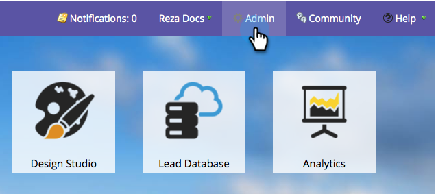

# Eliminar un canal de programa {#delete-a-program-channel}

Los canales de programa son una colección de estados o puntos de comprobación por los que los posibles clientes deben pasar en un programa.

Si hace uno por accidente o ya no necesita uno, puede eliminarlo.

1. Vaya a la sección **Admin**.

   

1. Haga clic en **Etiquetas**.

   

1. Seleccione el canal que desee eliminar, en Acciones de etiqueta, haga clic en Eliminar.

   >[!TIP]
   >
   >Si el canal está asociado con algún programa, no puede eliminarlo, solo ocultarlo.

   

¡Bam! También puede [eliminar estados específicos de los canales](/help/marketo/product-docs/administration/tags/delete-a-program-status-from-a-program-channel.md).
