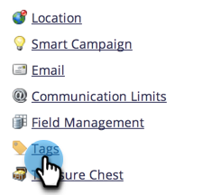

# Eliminar un canal de programa {#delete-a-program-channel}

Los canales de programa son una colección de estados o puntos de comprobación que los posibles clientes deben recorrer en un programa.

Si lo hace por accidente o ya no lo necesita, puede eliminarlo.

1. Vaya al área de **[!UICONTROL Admin]**.

   

1. Haga clic en **[!UICONTROL Etiquetas]**.

   

1. Seleccione el canal que desee eliminar. En el menú desplegable **[!UICONTROL Acciones de etiqueta]**, haga clic en **[!UICONTROL Eliminar]**.

   >[!TIP]
   >
   >Si el canal está asociado con algún programa, no puede eliminar, solo ocultar.

   

También puede [eliminar estados específicos de los canales](/help/marketo/product-docs/administration/tags/delete-a-program-status-from-a-program-channel.md).
