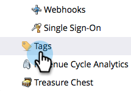

# Eliminación de un estado de programa de un canal de programa {#delete-a-program-status-from-a-program-channel}

Los estados del programa son los puntos de comprobación a través de una ruta de programas (canal). Si realiza un estado por error o ya no lo necesita, asegúrese de eliminarlo.

1. Vaya a la **Administrador** .

   

1. Haga clic en **Etiquetas**.

   

1. Seleccione el canal desde el que desea eliminar un estado y, a continuación, en **Acciones de etiqueta**, haga clic en **Editar**.

   

1. Haga clic en el icono rojo **X** para quitar el estado, haga clic en **Guardar**.

   

   >[!TIP]
   >
   >Si alguna persona está actualmente asignada al estado en cuestión, no puede eliminarla, pero puede ocultarla.

¡Bien hecho! También puede [eliminar todo un canal](/help/marketo/product-docs/administration/tags/delete-a-program-channel.md) si es necesario.
