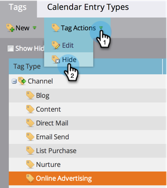

# Ocultar/mostrar un canal de programa {#hide-unhide-a-program-channel}

>[!NOTE]
>
>**Se requieren permisos de administración**

Puede [eliminar un canal de programa](/help/marketo/product-docs/administration/tags/delete-a-program-channel.md) si ningún programa lo está utilizando.  Sin embargo, una vez que se utiliza, tenemos que mantenerlo.  Sin embargo, puede ocultarlo si ya no lo necesita.

## Ocultar un canal de programa {#hide-a-program-channel}

1. Vaya al área de **[!UICONTROL Admin]**.

   

1. Haga clic en **[!UICONTROL Etiquetas]**.

   

1. Haga clic en el menú desplegable **[!UICONTROL Canal]** y seleccione el **[!UICONTROL Canal]** que desea ocultar.

   

1. En **[!UICONTROL Acciones de etiquetas]**, haga clic en **[!UICONTROL Ocultar]**.

   

¡Tranquilo, tranquilo, tranquilo!

## Mostrar un canal de programa {#unhide-a-program-channel}

1. Muestre un canal de programa marcando la casilla de verificación **[!UICONTROL Mostrar ocultos]**.

   
