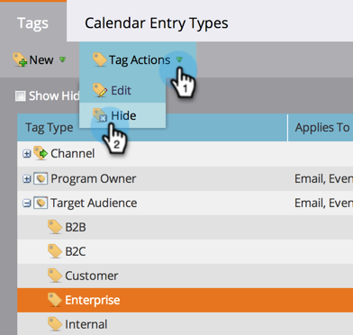

# Administración de valores de etiqueta {#managing-tag-values}

 Las etiquetas se utilizan para describir programas. Puede hacer todo lo que necesite, cada uno con valores únicos. A continuación se muestra cómo administrar estos valores.

>[!NOTE]
>
>**Se requieren permisos de administrador**

>[!PREREQUISITES]
>
>[Crear una etiqueta de programa nueva y valores de etiqueta](/help/marketo/product-docs/administration/tags/create-a-new-program-tag-and-tag-values.md)

## Adición de valores de etiqueta {#adding-tag-values}

1. En **Administración**, haga clic en **Etiquetas**.

   

1. Haga clic en **Nuevo** y luego en **Nuevo valor de etiqueta**.

   

1. Seleccione el **Tipo de etiqueta**.

   

1. Introduzca un **Value** y haga clic en **Add Other**. Puede agregar todos los valores que desee.

   

1. Añada los valores restantes y haga clic en **Create**.

   

1. ¡Debería ver los cambios inmediatamente!

   

## Ocultar valores de etiquetas {#hiding-tag-values}

Las etiquetas pueden ser utilizadas por programas antiguos. Puede decomisarlos para su uso futuro ocultando el tipo de etiqueta.

1. Seleccione la **Tag** y seleccione el **Value** que desee ocultar.

   

1. En **Acciones de etiqueta**, seleccione **Ocultar**.

   

## Mostrar valores ocultos {#show-hidden-values}

Si desea volver a ver los valores ocultos, haga lo siguiente:

1. Seleccione la casilla Mostrar oculto . Una vez comprobado, puede ver el valor oculto.

   

A continuación, puede mostrar los valores que desee utilizar en el futuro.
