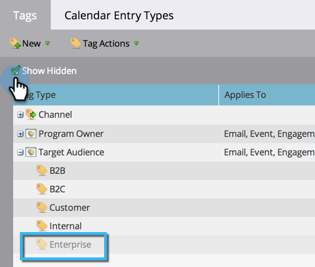

# Administración de valores de etiqueta {#managing-tag-values}

[Etiquetas](/help/marketo/product-docs/core-marketo-concepts/programs/working-with-programs/understanding-tags.md) se utilizan para describir programas. Puede crear tantas como necesite, cada una con valores únicos. A continuación se indica cómo administrar esos valores.

>[!NOTE]
>
>**Permisos de administración necesarios**

>[!PREREQUISITES]
>
>[Creación de una nueva etiqueta de programa y valores de etiqueta](/help/marketo/product-docs/administration/tags/create-a-new-program-tag-and-tag-values.md)

## Adición de valores de etiqueta {#adding-tag-values}

1. Vaya a la **[!UICONTROL Administrador]** área.

   

1. Clic **[!UICONTROL Etiquetas]**.

   

1. Clic **[!UICONTROL Nuevo]**, entonces **[!UICONTROL Nuevo valor de etiqueta]**.

   

1. Seleccione el **[!UICONTROL Tipo de etiqueta]**.

   

1. Introduzca una **[!UICONTROL Valor]** y haga clic en **[!UICONTROL Añadir otro]**. Puede agregar todos los valores que desee.

   

1. Añada los valores restantes y haga clic en **[!UICONTROL Crear]**.

   

Debería ver los cambios inmediatamente.

## Ocultar valores de etiqueta {#hiding-tag-values}

Los programas antiguos pueden utilizar etiquetas. Puede dejar de utilizarlos en el futuro ocultando el tipo de etiqueta.

1. Seleccione el **[!UICONTROL Etiqueta]** y seleccione la **[!UICONTROL Valor]** ¿quieres esconderte?

   

1. En **[!UICONTROL Etiquetar acciones]**, seleccione **[!UICONTROL Hide]**.

   

## Mostrar valores ocultos {#show-hidden-values}

Si desea volver a ver los valores ocultos, haga lo siguiente:

1. Seleccione el **[!UICONTROL Mostrar ocultos]** casilla de verificación Una vez comprobado, puede ver el valor oculto.

   

A continuación, puede mostrar los valores que desee utilizar en el futuro.
